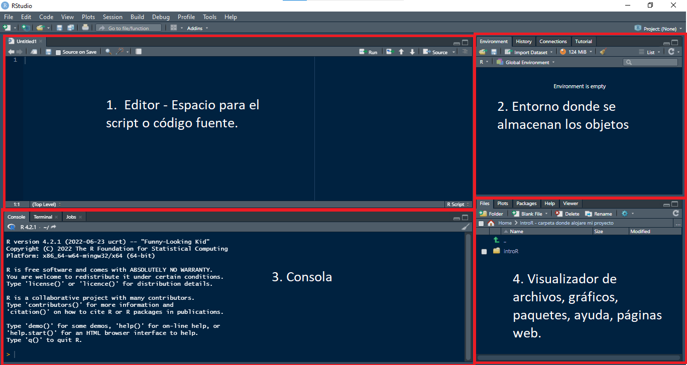
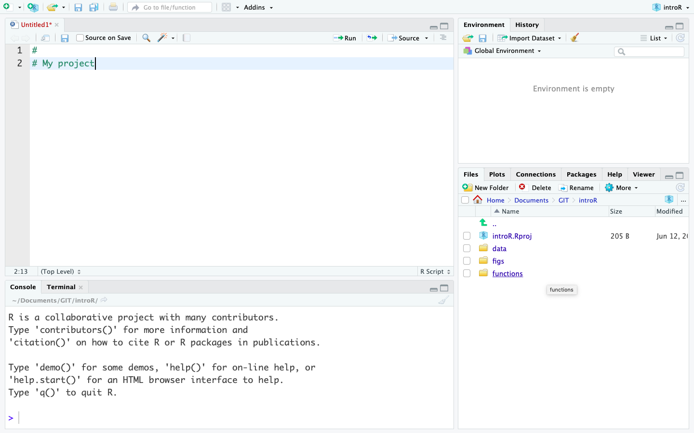
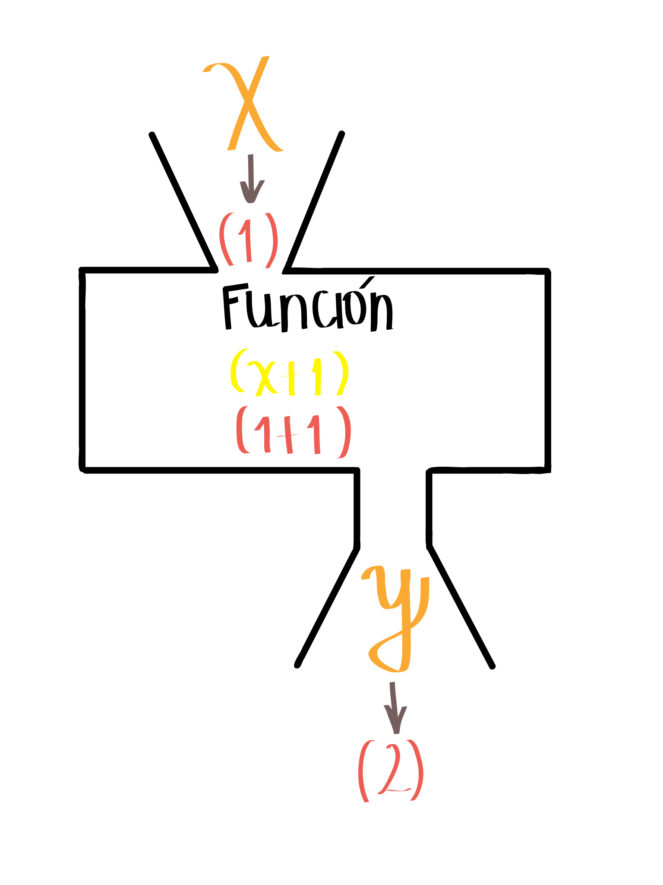
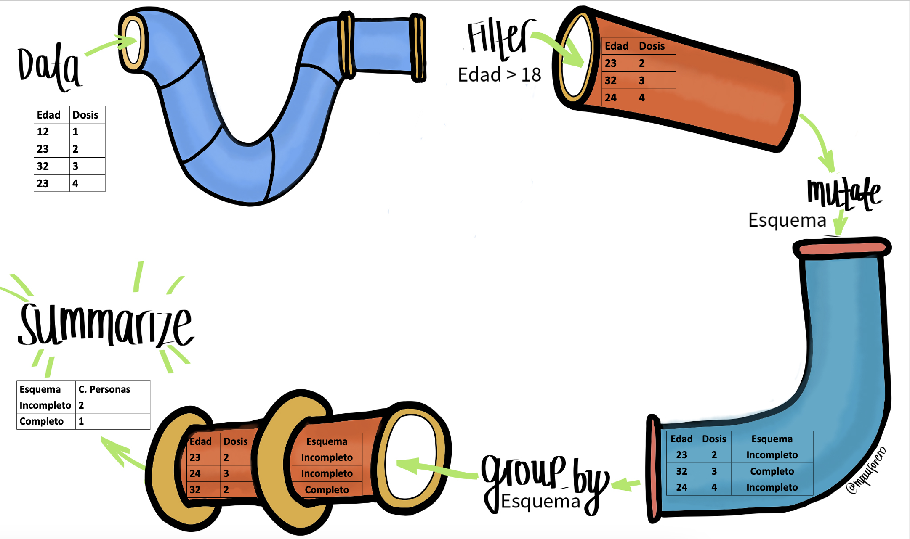

```{r setup, include=FALSE}
knitr::opts_chunk$set(echo = TRUE)
```

## 1. Introducción

En este taller aprenderemos a reconocer los distintos elementos en la interfaz de RStudio, estructuras en R y manejo de datos con Tidyverse. 

### 1.1. Motivación

R es un lenguaje de programación y un entorno de software utilizado en la práctica estadística y el análisis de datos. R y RStudio son herramientas esenciales para el estudio, análisis y toma de decisiones en salud pública, ya que permiten realizar análisis estadísticos detallados, modelar la propagación de enfermedades, visualizar datos de manera efectiva y automatizar tareas. Estas herramientas facilitan la manipulación y preparación de datos, fomentan la colaboración en proyectos de ciencia de datos, y la toma de decisiones basadas en evidencias. Además, son útiles en la formación y educación en análisis de datos para profesionales de la salud, áreas STEM y toma de decisiones.

### 1.2. Objetivos

- Identificar qué son R y RStudio.
- Reconocer la interfaz de RStudio.
- Describir algunas estructuras básicas en R: Matrices y tablas de datos.
- Describir el proceso de creación de funciones
- Reconocer el proceso de importación, exportación y transformación de bases de datos con Tidyverse.

### 1.3. Conceptos básicos a desarrollar

En esta práctica se desarrollarán los siguientes conceptos:

-   Algunas estructuras básicas en R: Matrices y tablas de datos.
-   Importación, exportación y transformación de tablas de datos.

### 1.4. Introducción a R

R es un lenguaje de programación especializado para análisis de datos, es de uso gratuito y software libre. Por otra parte, RStudio es un editor de R también disponible de manera gratuita. En los últimos años el uso de R ha crecido en el ámbito académico y de la industria. R, además de ser un lenguaje de programación, es también un entorno para computación estadística y creación de gráficos.
R además de ser un lenguaje de programación es un entorno para computación estadística y creación de gráficos.
[R-project](https://cran.r-project.org/doc/html/interface98-paper/paper_2.html)

## 2. Ambiente de R

La parte visual de RStudio está compuesta por 4 secciones principales:



1. Editor (sección superior izquierda): esta sección es fundamental para la reproducibilidad del código. Este editor permite guardar el código para que sea usado en futuras ocasiones. 
El código puede ser ejecutado en esta sección posicionando el cursor de texto al final de la línea de código que se ejecutará; otra opción es seleccionando la misma y empleando el comando Control+Enter para Windows o Command+Enter para Mac.

2. Entorno (sección superior derecha): en esta sección se pueden visualizar los objetos y funciones creados o importados en la sección de R. 
Objetos como vectores, matrices, arreglos, data frames, listas, objetos tipo ggplot, entre otros.

3. Consola (sección inferior izquierda): esta sección es donde se ejecuta el código. No solo se ejecuta el código que escrito en el editor, sino que también el código puede escribirse y ejecutarse aquí directamente presionando Enter. Sin embargo, cuando el código se ejecuta directamente en la consola, este no se almacena y cuando se cierra la sesión de R este se pierde.

4. Visualizador (sección inferior derecha): en esta sección se pueden visualizar los archivos en “Files”, los gráficos en “Plots”, los paquetes que ya están instalados en “Packages”, la ayuda de R con información de los paquetes y el funcionamiento en “Help”, y páginas web en “Viewer”.


## 3. Configuración de un proyecto en R

Una de las grandes ventajas de usar RStudio es la posibilidad de usar
los Proyectos en R (R Project)(indicado por un archivo `.Rproj`) lo que permite organizar el espacio de trabajo, el historial y los documentos fuente.

Para crear un Proyecto en R, es importante seguir los siguientes pasos:

(1) Abrir RStudio y, en la esquina superior derecha, seleccionar la pestaña
    *File* (Archivo) -\> *New Project...* (Proyecto Nuevo).
(2) Se desplegará una ventana con encabezado *New Project Wizard: Create Project*, ahora se debe seleccionar *New Directory* (Directorio Nuevo).


(3) En la ventana *Project Type*, para crear un nuevo proyecto en Rstudio se debe seleccionar *New Project* -\> *Create New Project*. En la casilla *Directory Name* (Nombre del Directorio) coloque el nombre deseado para su proyecto (e.g. "introR").

(4) Seleccione el botón *Browse...*. En este punto, es conveniente crear una carpeta que servirá de repositorio para su proyecto, así como las sub carpetas que necesita para organizar su trabajo (por ejemplo: datos, scripts, figuras). Una vez creadas, seleccione la carpeta que servirá de repositorio.

Al final, su proyecto debería parecerse a esta imagen



## 4. Estructuras en R

### 4.1. Vector 

En R, un vector es una estructura de datos indexada que permite almacenar varios elementos del mismo tipo en una única variable. Por ejemplo, podríamos tener un vector que contenga las edades de varias personas, o un vector que contenga los nombres de diferentes ciudades.

Los vectores en R son útiles porque permiten realizar operaciones y cálculos con facilidad. Los elementos del vector se pueden sumar, restar, multiplicar o dividir, y sus elementos son accesibles por medio posición o índice.

En resumen, un vector en R es una colección ordenada de elementos del mismo tipo que permite almacenar y manipular datos de manera eficiente. Es una herramienta fundamental para trabajar con datos en R y realizar diferentes tipos de análisis y operaciones.

Los vectores se pueden crear ejecutando el comando  `c()`, como se puede visualizar a continuación:

#### Ejemplos

```{r, error = TRUE, eval = FALSE}

nombre <- c("Ana", "Miguel", "Juan", "Lina") # Nombre de las personas

ciudad <- c("Cali","Bogota", "Medellin", "Bogota") # Ciudad de residencia

edad <- c(15, 25, 32, 40)  # Edad de las personas

vacunado <- c(TRUE, FALSE, FALSE, TRUE) # Estado de vacunación

dosis <- c(1L, 0L, 0L, 2L) # Número de dosis recibidas
```

### 4.2. Data.frame (Tabla de datos)

Imaginemos un Data.frame como una tabla con filas y columnas, similar a una hoja de cálculo en Excel. Cada columna representa un tipo de información específica o variable (Por ejemplo, la edad, el departamento o nombre) y cada fila representa un conjunto de datos relacionados. Es importante tener en cuenta que los Data.frame (Tabla de datos)  están compuestas por vectores cuyas dimensiones deben ser iguales, es decir que todas las columnas deben tener el mismo número de filas. 

En R, un data frame es una forma muy útil de almacenar y organizar datos. Puede pensarse como una forma de mantener diferentes tipos de información juntos en una estructura organizada. Por ejemplo, se puede tener una columna para los nombres de las personas, otra para sus edades y otra para el departamento en el que viven.

La gran ventaja de un Data.frame es que permite realizar operaciones y análisis sobre los datos de manera ágil y eficiente. Se pueden realizar cálculos, filtrar datos, realizar gráficos y mucho más.

En resumen, un Data.frame en R es una tabla conformada por columnas con el mismo número de filas que permite almacenar y trabajar con diferentes tipos de datos de manera organizada y eficiente. Por lo tanto, es una herramienta poderosa para el análisis y manipulación de datos en R.

Para crear una tabla de datos se debe ejecutar el comando `data.frame()`. Por ejemplo, utilizando los vectores que definimos en la sección anterior:

```{r, error = TRUE, eval = FALSE}
datos_vacunas <- data.frame(
  nombre = nombre, 
  ciudad = ciudad,
  edad = edad,
  vacunado = vacunado,
  dosis = dosis)
```

Tiene las siguientes propiedades:

- `colnames()`: nombres de las columnas
- `rownames()`: nombres de las filas
- `nrow()`: número de filas
- `ncol()`: número de columnas 
- `length()`: longitud de la tabla de datos

Para acceder a la estructura general de una tabla de datos (y en general cualquier objeto de R) usamos el
comando `str`

```{r, error=TRUE, eval = FALSE}
str(datos_vacunas)
```

Para acceder a los diferentes componentes de la tabla de datos usamos esta
sintaxis `[,]`, donde la primera dimensión corresponde a filas y la
segunda dimensión a columnas.

```{r, error = TRUE, eval = FALSE}
datos_vacunas[1, 2]
```

También es posible acceder a la información a partir de los nombres de las columnas.

```{r, error = TRUE, eval = FALSE}
datos_vacunas$nombre
```

#### 4.2.1. Importar una tabla de datos

R permite a los usuarios no solo abrir, sino también crear tablas de
datos. Hay tres fuentes de conjuntos de datos:

-   Tabla de datos importada (desde los formatos `.xlsx`, `.csv`,
    `.stata`, o `.RDS`, entre otros)
-   Tabla de datos que forma parte de un paquete en R (Ej. MASS,
    islands, etc)
-   Tabla de datos creado durante la sesión en R (Ej. las estructuras
    de los primeros ejercicios)

Para importar una tabla de datos de diferentes fuentes necesitamos
emplear diferentes tipos de funciones, aquí algunos ejemplos del tipo de
datos, el paquete que es necesario cargar y la función a utilizar.

| Tipo de datos | Función                        | Paquete |
|---------------|--------------------------------|---------|
| csv           | read_csv                       | readr   |
| xls           | read_excel, read_xls,read_xlsx | readxl  |
| RDS           | readRDS                        | base    |
| dta           | read_dta                       | haven   |
| sas           | read_sas                       | haven   |
| sav           | read_spss                      | haven   |

**Abrir y explorar una tabla de datos importados de Excel**

Este es el conjunto de datos para esta práctica:
[datos_covid.xlsx](https://raw.githubusercontent.com/TRACE-LAC/TRACE-LAC-data/main/datos_covid.xlsx):

Dentro del directorio en el que está trabajando actualmente, cree una
carpeta llamada *data*. Guarde la tabla de datos descargado en la
carpeta *data* que acaba de crear.

Para importar tablas de datos desde RDS, se puede usar la función
`read_excel`, del paquete `readxl`:

```{r, eval=FALSE}
library(readxl)
covid19 <- read_excel("data/datos_covid.xlsx")
```

## 5. Tipos de datos y operadores en R

### 5.1. Tipos de datos
R tiene la capacidad de almacenar y procesar distintos tipos de datos.
Entre estos se encuentran:


1.  Datos numéricos fraccionados (double. Ej: 3.3)

2.  Datos enteros (integer. Ej: 3)

3.  Datos en caracteres (character)

4.  Tipos de datos booleanos/ Datos lógicos (logic. Ej: FALSE, TRUE)

5.  Datos factor (factor. Sirven para categorizar. Ej: femenino,
    masculino, otro o primero, segundo.)

6.  Datos tipo fechas (date. Ej: 01/01/2022)

7. Datos NA, NAN e Inf

### 5.2. Operadores

Los operadores herramientas matemáticas que nos permiten realizar diferentes tareas con los datos que tenemos disponibles; por ejemplo, con el operador `+` podemos efectuar una suma o incrementar un índice. Algunos de los operadores más utilizados en R son los siguientes:

1.  Operadores aritméticos (Ej: +, -, \*)

2.  Operadores de comparación (Ej: \<, \>, ==, \>=, \<=, !=)

3.  Operadores booleanos (& (and), \| (or), ! (not))

## 6. Funciones

Imagina una función como una especie de “caja mágica” que recibe ciertos datos o información como entrada y produce un resultado o respuesta específica como salida. Es como seguir una receta que toma ingredientes y como resultado obtienes un plato delicioso. 

Por ejemplo, considere la función $y(x)=x+1$. Si ingresamos un dato $x$ (en el caso de la imagen, $x=1$), y aplicamos la función, obtendremos como salida el dato $y(1)=1+1=2$.

<center>
{width=10.0cm}
</center>

En general, una función consiste de una secuencia de instrucciones con el fin de llevar a cabo una tarea. De esta forma, por medio del uso de funciones es posible sistematizar procesos complejos que se realizan de manera rutinaria.

<!-- El paquete *base* de R cuenta con una serie de funciones básicas predeterminadas, las cuales incluyen tanto operaciones aritméticas básicas, como operaciones más complejas de utilidad para el análisis estadístico.  -->

Los componentes básicos de una función son:

- **name (nombre)**: es el nombre que se da a la función(Por ejemplo: myfun)
formals (argumentos): son la serie de elementos que controlan cómo llamar a la función.
- **body (cuerpo):** es la serie de operaciones o modificaciones a los argumentos.
- **output (salida o resultado)**: son los resultados después de modificar los argumentos. Si esta salida corresponde a una serie de datos, podemos extraerla usando el comando return.

## 7. Manipulación de datos con Tidyverse

Para administrar mejor los conjuntos de datos, se recomienda instalar y utilizar el paquete `tidyverse`, el cual carga automáticamente varios paquetes (dplyr, tidyr, tibble, readr, purr, entre otros) que son útiles para la manipulación de datos.

```{r,eval=FALSE,echo=TRUE}
install.packages('tidyverse')
```

```{r message=FALSE, warning=FALSE, include=TRUE}
library(tidyverse)
```

A continuación, verá algunas de las funciones más utilizadas de
`tidyverse`.

### 7.1. Operador tubería (pipe)

El operador tubería (pipe function) `%>%` es un operador que se usa continuamente, por lo que es clave para usar Tidyverse y facilita la
programación. El operador tubería permite al usuario enfatizar una
secuencia de acciones en un objeto.



#### Ejemplos

**Ejemplo 1**

La siguiente línea de código
```{r, error=TRUE, eval = FALSE}
str(datos_vacunas)
```
es equivalente a:
```{r, error=TRUE, eval = FALSE}
datos_vacunas %>% str()
```
**Ejemplo 2**
Supongamos que necesitamos sumarle 1 a una lista de números, luego multiplicar todos sus elementos por 2 y a continuación calcular su promedio. Sin el uso de el operador tubería, estas operaciones se pueden realizar de la siguiente manera:
```{r, error=TRUE, eval = FALSE}
numeros <- c(5, 10, 15, 20)
suma_uno <- numeros + 1
multiplicado_por_dos <- suma_uno * 2
promedio <- mean(multiplicado_por_dos)
```
Utilizando el operador tubería, la sintaxis de esta operación se puede simplificar:
```{r, error=TRUE, eval = FALSE}
library(magrittr)
numeros <- c(5, 10, 15, 20)
promedio <- numeros %>%  + 1 %>% multiply_by(2) %>%  mean()
```

### 7.2. Funciones básicas de Tidyverse
Del paquete `dyplr`, las funciones más comunes son:

-   `glimpse`: utilizado para explorar rápidamente una tabla de datos
-   `summarise`: genera tablas resumen. Reduce las dimensiones de una
    tabla de datos
-   `group_by`: crea grupos dentro de una tabla de datos. las
    funciones del `dplyr` manipulan cada grupo por separado y luego
    combina los resultados
-   `select`: extrae columnas de una tabla de datos
-   `filter`: extrae filas de una tabla de casos
-   `arrange`: ordena filas de una tabla de datos por el valor de una
    variable particular si es numérico, o por orden alfabético si es un
    carácter
-   `mutate`: genera una nueva variable
-   `rename`: cambia el nombre de la variable

Otra función que se utiliza continuamente en el análisis de datos es:
-   `unique`: te permite extraer sólo los elementos únicos del conjunto de datos, eliminando las repeticiones

Veamos en más detalle las funciones más comunes del paquete `dyplr`

### `glimpse`

Esta función se utiliza para explorar información de los datos como: número de filas (que en este caso sería el número de observaciones o datos de nuestra población), número de columnas y sus nombres (que en este caso serían el número de variables y sus nombres), entre "\< \>" encontrará el tipo de dato (`dbl` para `double`, `chr` para `character`, entre otros) y un breve listado de algunos de los primeros valores de los datos. La función `glimpse` se puede aplicar sobre `dat` mediante el operador tubería como se muestra a continuación:

```{r, error=TRUE, eval = FALSE}
covid19 %>% glimpse()
```

### `summarise`

La función `summarise` permite resumir los datos de acuerdo con criterios definidos por funciones que retornan valores que pueden ser de interés. Por ejemplo, para calcular la media de edad y el conteo total de casos:

```{r, error=TRUE, eval = FALSE}
covid19 %>% summarise(media = mean(edad), numero = n())
```

### `group_by`

La función `group_by` no tiene un uso evidente si es empleada sola, dado
que ocurre un proceso interno de agrupación de los datos. Pero al ser
usada con otras funciones como por ejemplo `summarise` es posible ver su
efecto. Por ejemplo, el siguiente comando agrupa los datos por sexo y calcula, para cada grupo, el conteo de casos y su correspondiente media de edad:

```{r, error=TRUE, eval = FALSE}
covid19 %>% 
  group_by(sexo) %>% 
  summarise(numero = n(), media_edad = mean(edad))
```

### `select`

La función `select` es útil en caso de querer extraer una o varias columnas de un Data.frame. Por ejemplo, se puede extraer la variable `edad` de `dat` mediante el siguiente comando:

```{r, error=TRUE, eval = FALSE}
covid19 %>% select(edad) #empleando el nombre de la columna
covid19 %>% select(c(1,2)) #o su ubicación en los datos
```

### `filter`

Otra función de gran utilidad es `filter`. Esta se puede usar para seleccionar filas de acuerdo con una o más condiciones lógicas. Por ejemplo, para filtrar los pacientes menores de 28 años:

```{r, error=TRUE, eval = FALSE}
covid19 %>% filter(edad < 28)
```

Como puede observar, el resultado contiene todas las variables de la tabla, pero los datos se limitan a aquellos que en edad sean menores de 28 años.

Ahora, filtre por los pacientes de 28 años o menos de sexo femenino. En este caso,
al pedir que se incluyan adicionalmente los de 28 años también ya no se
emplea unicamente el signo "\<" sino que se lo acompaña del símbolo "=":

```{r, error=TRUE, eval = FALSE}
covid19 %>% glimpse() #Observe como están expresadas las variables también puede usar la función `table()`
covid19 %>% filter(sexo == "F", edad <= 28) #Ahora sabe como filtrar el sexo
```

### `arrange`

Para los casos donde se necesita organizar los datos por una o más
variables, se puede emplear la función `arrange`. Por ejemplo, para organizaros datos por edad, o por edad y sexo:

```{r, error=TRUE, eval = FALSE}
covid19 %>% arrange(edad)
covid19 %>% arrange(edad,sexo)
```

Por configuración predeterminada la función organiza los valores de
menor a mayor, en caso de querer organizarlos de mayor a menor se puede
emplear `desc` al interior de la función `arrange`.

```{r, error=TRUE, eval = FALSE}
covid19 %>% arrange(desc(edad))
```

### `mutate`

Para crear una nueva columna con datos de una ya existente resulta de
utilidad la función `mutate`. Esta función requiere el nombre de la
columna a crear y de la columna de la que queremos copiar los datos. La
columna nueva por configuración predeterminada se ubicará al final de
las variables.

```{r, error=TRUE, eval = FALSE}
unique(covid19$nombre_departamento)
covid19 <- covid19 %>% mutate(nombre_departamento = toupper(nombre_departamento))
```

### `rename`

En caso de que no se desee crear una nueva variable sino renombrar una ya existente, conviene usar la función `rename`. Por ejemplo, cambie el
nombre *nombre_departamento* por el nombre *departamento*.

```{r, error=TRUE, eval = FALSE}
covid19 %>% rename(departamento = nombre_departamento)
```

### `slice`

Ya se vio previamente cómo seleccionar columnas por medio de la función `select`. En caso de requerir seleccionar filas específicas de un Data.frame, la función `slice` resulta de gran utilidad. Por ejemplo, para seleccionar de la fila 10 a la 15:

```{r, error=TRUE, eval = FALSE}
covid19 %>% slice(10:15)
```

Alternativamente, en caso de que no se quiera emplear tidyverse, esta acción podría realizarse mediante el siguiente comando:

```{r, error=TRUE, eval = FALSE}
covid19[10:15, ]
```

Sin embargo, usar tidyverse y sus funciones resulta de gran utilidad. Por ejemplo, suponga que necesita obtener los primeros 5 sujetos de la base que tengan edades entre 13 y 14 años por cada sexo. Usando tidyverse, la solución de este problema se vería así:

```{r, error=TRUE, eval = FALSE}
covid19 %>% 
  group_by(sexo) %>% 
  filter(edad >= 13, edad <=14) %>%
  slice(1:5)
```

En caso de uno usar el operador tubería (pipe), el comando anterior se vería así:

```{r, error=TRUE, eval = FALSE}
slice(filter(group_by(covid19, sexo),edad >= 13, edad <=14),1:5)
```

Como puede notar, el resultado es idéntico. Sin embargo, es preferible usar el operador tubería cuando se aplican varias funciones sucesivamente sobre un objeto porque simplifica la sintaxis del código y, como se puede ver, la lectura del mismo se hace más sencilla. Además, emplear el operador tubería facilita la modificación del proceso en caso de ser necesario.

## 8. Reto

Esta vez se cargará un tipo diferente de datos, estos los puede
encontrar en el enlace
<https://github.com/TRACE-LAC/TRACE-LAC-data/blob/main/datos_covid.RDS?raw=true>.
Los datos pueden ser cargados desde el computador o desde una ubicación
en internet. Para este ejercicio cargue la base de datos datos_covid.RDS
directamente desde internet con los comandos:

```{r, error=TRUE, eval = FALSE}
url <- "https://github.com/TRACE-LAC/TRACE-LAC-data/blob/main/datos_covid.RDS?raw=true"

covid19 <- readr::read_rds(url)
```

Por favor, realice las siguientes actividades:

-   **Explore los datos**

Como puede observar los nombres de las columnas (variables) están con
algunas letras en mayúsculas, otras con tildes y con espacios. Lo
primero que es necesario hacer es poner los nombres en una forma que
permitan evitar errores, es decir, todos en minúsculas, sin caracteres
especiales, tildes ni espacios. Para ello se usará la función
`clean_labels` del paquete `epitrix`.

```{r, error=TRUE, eval = FALSE}
#Primero se llamarán los nombres de las variables con la función `names`
names(covid19)
#ahora a estos nombres se les reasignará nombres limpios
names(covid19) <- names(covid19) %>% epitrix::clean_labels()

names(covid19)
```

Ahora que los nombres están limpios es posible seguir.

-   Filtre los datos para Cali (observe bien cómo están escritos los
    datos dentro de la variables)
-   Agrupe los datos por departamento y cuente los casos por cada uno.
-   Agrupe los datos por departamento y saque la media de edad de cada
    uno.
-   Cambie el nombre de estado por gravedad.
-   Ordene los datos por sexo y seleccione las 5 primeras filas de cada
    uno.
-   Haga una tabla que muestre cuantas personas de cada etnia aparecen en la base 
    ubicados en la ciudad de Bogota.
-   Seleccione las 5 primeras filas de solo el número de identificación
    del caso.

### Enlaces utiles

[Introducción a
R](http://people.umass.edu/biep640w/pdf/RStudio101%20-%20Introduction%20by%20Oscar%20Torres-Reyna.pdf)

[Historia de
R](https://www.genbeta.com/desarrollo/introduccion-a-r-historia-de-un-lenguaje-de-computacion-para-el-analisis-de-datos)

## Contribuciones

-   Zulma M. Cucunuba: Versión inicial
-   Zhian N. Kamvar: Ediciones menores
-   Kelly A. Charniga: Ediciones menores
-   José M. Velasco-España: Traducción de Inglés a Español y edición
-   Andree Valle-Campos: Ediciones menores
-   Miguel E. Gámez López: Ediciones menores
-   Nicolás T. Domínguez: Ediciones menores
-   Jaime A. Pavlich-Mariscal: Edición

Contribuciones son bienvenidas vía [pull
requests](https://github.com/reconhub/learn/pulls).

## Asuntos legales

**Licencia**: [CC-BY](https://creativecommons.org/licenses/by/3.0/)
**Copyright**: Zulma M. Cucunuba, 2019
