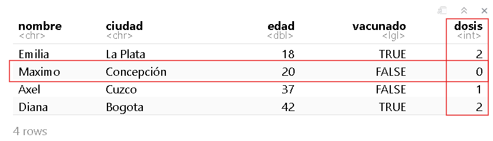

```{r setup, include=FALSE}
knitr::opts_chunk$set(echo = TRUE)
```

# 1. Introducción

R es un lenguaje de programación y un entorno de software utilizado en la práctica estadística y el análisis de datos. R y RStudio son herramientas esenciales para el estudio, análisis y toma de decisiones en salud pública ya que permiten realizar análisis estadísticos detallados, modelar la propagación de enfermedades, visualizar datos de manera efectiva y automatizar tareas. Estas herramientas facilitan la manipulación y preparación de datos, fomentan la colaboración en proyectos de ciencia de datos, y la toma de decisiones basadas en evidencias. Además, son útiles en la formación y educación en análisis de datos para profesionales de la salud, áreas STEM y toma de decisiones. En este taller aprenderemos a reconocer los distintos elementos de la interfaz de RStudio, estructuras en R y manejo de datos con Tidyverse. Esto sentará las bases fundamentales para adquirir las habilidades necesarias en la programación en R y el análisis de datos.

# 2. Objetivos

- Reconocer y hacer uso de R y RStudio.
- Conocer los tipos de datos y operados básicos en R.
- Comprender las estructuras básicas de datos en R tales como vectores y tablas de datos.
- Comprender el proceso de creación de funciones.
- Reconocer el proceso de importación, exportación y transformación de bases de datos con Tidyverse.

# 3. Tabla de contenido
- Tema 1: Introducción
- Tema 2: Instalación de R y RStudio
- Tema 3: Ambiente de RStudio
- Tema 4: Configuración de un proyecto en RStudio
- Tema 5: Tipos de datos y operadores en R
- Tema 6: Estructuras de datos en R
- Tema 7: Funciones
- Tema 8: Manipulación de datos con Tidyverse
- Tema 9: Reto


# 4. Temas


## **Parte A** del taller 01


### Tema 1: Introducción a R

R es un lenguaje de programación especializado para análisis de datos, es de uso gratuito y software libre. Por otra parte, RStudio es un editor de R también disponible de manera gratuita. La diferencia entre R y RStudio radica en que en R es el lenguaje de programación en el que escribimos el código y RStudio es el ambiente de desarrollo que permite trabajar con R de manera más fácil y amigable.

En los últimos años el uso de R ha crecido en el ámbito académico y de la industria. R, además de ser un lenguaje de programación, es también un entorno para computación estadística y creación de visualizaciones. R y RStudio son herramientas esenciales para el estudio, análisis y toma de decisiones en salud pública, ya que permiten realizar análisis estadísticos detallados, modelar la propagación de enfermedades, visualizar datos de manera efectiva y automatizar tareas. Estas herramientas facilitan la manipulación y preparación de datos, fomentan la colaboración en proyectos de ciencia de datos, y la toma de decisiones basadas en evidencia. Además, son útiles en la formación y educación en análisis de datos para profesionales de la salud, áreas STEM y toma de decisiones.


### Tema 2: Instalación de R y RStudio

Para instalar R y RStudio debemos ir a nuestro navegador de confianza. Allí vamos a buscar r-project, que es la página oficial de R (https://www.r-project.org/). Recordemos que este es un software de uso libre, no hay que hacer ningún pago por su descarga o uso.

<center>

</center>

Busca la opción de descarga “download R” y sigue las instrucciones.

Para instalar Rstudio debemos ir a https://posit.co/download/rstudio-desktop/ y buscar donde diga *Install RSudio*. Si tenemos Windows podemos dar click en el recuadro azul. Si es otro sistema operativo abajo encontraremos una lista con las diferentes opciones. Para instalar, sigue las instrucciones.

<center>

</center>

Recuerda ejecutar el archivo que se descargó siguiendo los pasos. Es recomendable que en el momento de la instalación elijamos la opción de dejar un acceso directo en el escritorio.

Para comprobar que la instalación fue satisfactoria y en general para hacer uso de R y RStudio debemos buscar en la ubicación que hayamos elegido en la instalación donde quedó Rstudio y dar doble clic o clic derecho y abrir. Lo primero que vemos al momento de abrir Rstudio es la siguiente pantalla:

<center>

</center>

Escribe 2+2 donde aparece el curso y da enter, si te aparece el resultado 4 ¡Está todo listo para empezar!


### Tema 3: Ambiente de RStudio

La parte visual de RStudio está compuesta por 4 secciones principales:

<center>

</center>

1. **Editor (sección superior izquierda):** esta sección es fundamental para la reproducibilidad del código. Este editor permite guardar el código para que sea usado en futuras ocasiones. 
El código puede ser ejecutado en esta sección posicionando el cursor de texto al final de la línea de código que se ejecutará; otra opción es seleccionando la misma y empleando el comando `Control+Enter` para Windows o `Command+Enter` para Mac.

2. **Entorno (sección superior derecha):** en esta sección se pueden visualizar los objetos y funciones creados o importados en la sección de R. 
Objetos como vectores, matrices, arreglos, `data frames`, listas, objetos tipo `ggplot`, entre otros.

3. **Consola (sección inferior izquierda):** esta sección es donde se ejecuta el código. No solo se ejecuta el código que escrito en el editor, sino que también el código puede escribirse y ejecutarse aquí directamente presionando `Enter`. Sin embargo, cuando el código se ejecuta directamente en la consola, este no se almacena y cuando se cierra la sesión de R este se pierde.

4. **Visualizador (sección inferior derecha):** en esta sección se pueden visualizar los archivos en “`Files`”, los gráficos en “`Plots`”, los paquetes que ya están instalados en “`Packages`”, la ayuda de R con información de los paquetes y el funcionamiento en “`Help`”, y páginas web en “`Viewer`”.


### Tema 4: Configuración de un proyecto en RStudio

Una de las grandes ventajas de usar RStudio es la posibilidad de usar
los Proyectos en R (R Project)(indicado por un archivo `.Rproj`) lo que permite organizar el espacio de trabajo, el historial y los documentos fuente.

Para crear un Proyecto en R, es importante seguir los siguientes pasos:

(1) Abrir RStudio y, en la esquina superior derecha, seleccionar la pestaña
    **File (Archivo) -\> New Project... (Proyecto Nuevo)**.
    
(2) Se desplegará una ventana con encabezado **New Project Wizard: Create Project**, ahora se debe seleccionar **New Directory (Directorio Nuevo)**.

(3) En la ventana **Project Type**, se debe seleccionar **New Project -\> Create New Project**. En la casilla **Directory Name (Nombre del Directorio)** coloque el nombre deseado para su proyecto (Ej: "`introR`").

(4) Hacemos clic en el botón **Browse...** para buscar la ubicación dentro de nuestro computador donde deseamos guardar el proyecto.

<center>
{width="460"}
</center>

(5) Creamos una carpeta con el mismo nombre del proyecto (Ej: "`introR`"), así como las subcarpetas que necesitamos para organizar nuestro trabajo y resultados: datos, scripts y figuras. Al final, el proyecto debería parecerse a esta imagen:

<center>
{width="460"}
</center>


### Tema 5. Tipos de datos y operadores en R

#### 5.1. Tipos de datos
R tiene la capacidad de almacenar y procesar distintos tipos de datos.
Entre estos se encuentran:


- Numéricos fraccionados `(double. Ej: 3.3)`
- Enteros `(integer. Ej: 3)`
- Caracteres `(character. Ej: municipio, sexo o nombre)`
- Booleanos o lógicos `(logic. Ej: FALSE, TRUE)`
- Tipo fechas `(date. Ej: 01/01/2022)`
- Datos `NA`, `NAN` e `Inf`. La diferencia entre `NA`, `NAN` e `Inf` es que `NA` indica que hay dato faltante “missing”, `NAN` significa “not a number”; es decir, hay información, pero es un error y el resultado no es numérico, por ejemplo `0/0`. `Inf` indica que hay operaciones cuyo resultado es infinito como por ejemplo `1/0`. Si se hace operaciones entre tipos variables se pueden obtener `Inf`.


#### 5.2. Operadores

Los operadores herramientas matemáticas que nos permiten realizar diferentes tareas con los datos que tenemos disponibles; por ejemplo, con el operador `+` podemos efectuar una suma o incrementar un índice. Algunos de los operadores más utilizados en R son los siguientes:

##### 5.2.1.  Operadores aritméticos `(Ej: +, -, *` que corresponden a suma, resta y multiplicación respectivamente)

##### 5.2.2.  Operadores de comparación `(Ej: <, >, ==, >=, <=, !=)`

##### 5.2.3.  Operadores booleanos `(& (and), | (or), ! (not))`

##### 5.2.4. Operadores de asignación 
<br>

`<-` Este es un operador común en R para asignar un determinado valor a una variable y el alcance está dentro de la función y también fuera de ella.

Ejemplo
```{r, error = TRUE, eval = FALSE}
nombre <- "Laura"
```

`=` Este operador se utiliza para establecer un parámetro en un valor dentro de una función. El alcance está solo dentro de la función. La variable todavía contiene su valor original fuera de la función


### Tema 6. Estructuras en R

#### 6.1. Vector 

En R, un vector es una estructura de datos indexada que permite almacenar varios elementos del mismo tipo en una única estructura. Por ejemplo, podríamos tener un vector que contenga las edades de varias personas, o un vector que contenga los nombres de diferentes ciudades.

Los vectores en R son útiles porque permiten realizar operaciones y cálculos con facilidad. Los elementos del vector se pueden sumar, restar, multiplicar o dividir, y sus elementos son accesibles por medio posición o índice.

En resumen, un vector en R es una colección ordenada de elementos del mismo tipo de datos (ver Tema 5) que permite almacenar y manipular datos de manera eficiente.

Para crear un vector en el código o script se escribe el nombre con el que se va a reconocer (por ejemplo, edad o ciudad) y luego se debe escribir el símbolo `<-` (que da la orden a R para crear el vector). Luego se escribe letra `c` que es la asignación que permite inicializar el vector. Cada componente debe ir separado por comas, si son caracteres debe ir entre comillas (si son números no), si es dato booleano (falso o verdadero) tampoco va en comillas.

Así, los vectores se pueden crear ejecutando el comando `c()`, como se puede visualizar a continuación:


```{r, error = TRUE, eval = TRUE}

nombre <- c("Emilia", "Maximo", "Axel", "Diana") # Nombre de las personas

ciudad <- c("La Plata","Concepcion", "Cuzco", "Bogota") # Ciudad de residencia

edad <- c(18, 20, 37, 42)  # Edad de las personas

vacunado <- c(TRUE, FALSE, FALSE, TRUE) # Estado de vacunación

dosis <- c(2L, 0L, 1L, 2L) # Número de dosis recibidas`
```

Nota: El uso del símbolo `#` permite comentar el código, es decir poner notas que expliquen una o más líneas del código.


#### 6.2. Data.frame (Tabla de datos)

Imaginemos un `data.frame` como una tabla con filas y columnas, similar a una hoja de cálculo en Excel. Cada columna representa un tipo de información específica (un vector) o variable (Por ejemplo, la edad, el departamento o el nombre). En este ejemplo, cada fila corresponde al registro de esas variables para un individuo. Es importante tener en cuenta que los `data.frame` (Tabla de datos) están compuestos por vectores cuyas dimensiones deben ser iguales, es decir que todas las columnas deben tener el mismo número de filas. Siguiendo la analogía de Excel, podemos pensar que cada vector es una columna de una hoja de Excel.

Una ventaja de trabajar con `data.frame` en R en vez de una hoja de excel es que a medida que el tamaño de la tabla va aumentando, en R se puede trabajar más rápido y eficientemente.

Para crear una tabla de datos se debe ejecutar el comando `data.frame()`. Por ejemplo, utilizando los vectores que definimos en la sección anterior:

```{r, error = TRUE, eval = TRUE}
datos_vacunas <- data.frame(
  nombre = nombre, 
  ciudad = ciudad,
  edad = edad,
  vacunado = vacunado,
  dosis = dosis)
```

Ahora observemos cómo quedó la tabla de datos

```{r, error = TRUE, eval = TRUE}
datos_vacunas 
```

Algunas funciones que permiten conocer características como nombres o tamaños de las filas o columnas del `data.frame` son:

- `colnames()`: nombres de las columnas
- `rownames()`: nombres de las filas
- `nrow()`: número de filas
- `ncol()`: número de columnas 
- `length()`: longitud de la tabla de datos

Ahora, para acceder a la descripción de la estructura general de una tabla de datos (y en general cualquier objeto de R) usamos el comando `str`, en este caso escribimos:

```{r, error = TRUE, eval = TRUE}
str(datos_vacunas)
```

Esto nos indica que la estructura `(datos_vacunas)` corresponde a un `data.frame` con 4 observaciones y 5 variables.

Si usamos el comando `str(datos_vacunas$nombre)` podemos ver la estructura de esa variable, que en este caro es un vector de caracteres con longitud de 1 a 4.

```{r, error = TRUE, eval = TRUE}
str(datos_vacunas$nombre)
```

Para acceder a los diferentes componentes de la tabla de datos usamos la sintaxis `[,]`, donde la primera dimensión corresponde a filas y la segunda dimensión a columnas.

Por ejemplo, si queremos saber cuántas dosis de vacunas se aplicó Maximo ¿qué debemos hacer? Veamos a qué fila y columna corresponde este dato: 

```{r, error = TRUE, eval = FALSE}
datos_vacunas
```

<center>
{width=10.0cm}
</center>

Vemos que Maximo está en la fila 2 y las dosis en la columna 5. Por lo tanto, la intersección de estas dos variables nos dará el número de dosis que tiene Maximo.

```{r, error = TRUE, eval = TRUE}
datos_vacunas[2, 5] 
```


#### 6.3. Crear y abrir tablas de datos

R nos permite no solo crear tablas de datos sino también abrir archivos que las contengan. De hecho, la mayoría de las veces no se crean directamente los `data.frame` en R sino que se importa un `data.frame` de alguna fuente de datos, por ejemplo, la base de datos del sistema de vigilancia de algún evento de interés. Para esto, en R hay tres fuentes de conjuntos de datos que podemos utilizar:

-   Tabla de datos importada (desde los formatos `.xlsx`, `.csv`,`.stata`, o `.RDS`, entre otros)
-   Tabla de datos que forma parte de un paquete en R (Ej. `MASS, islands`, etc)
-   Tabla de datos creado durante la sesión en R (Ej. las estructuras de los primeros ejercicios)

##### 6.3.1. Importar una tabla de datos

Para importar una tabla de datos de diferentes fuentes necesitamos emplear diferentes tipos de funciones, aquí algunos ejemplos del tipo de datos, y la librería que es necesario cargar y la función a utilizar.

| Tipo de datos | Función                        | Paquete |
|---------------|--------------------------------|---------|
| csv           | read_csv                       | readr   |
| xls           | read_excel, read_xls,read_xlsx | readxl  |
| RDS           | readRDS                        | base    |
| dta           | read_dta                       | haven   |
| sas           | read_sas                       | haven   |


##### 6.3.2. Abrir y explorar una tabla de datos importados de Excel

Este es el conjunto de datos para esta práctica:
[datos_covid.xlsx](https://raw.githubusercontent.com/TRACE-LAC/TRACE-LAC-data/main/datos_covid.xlsx):

Dentro del directorio en el que está trabajando actualmente, cree una
carpeta llamada *data*. Guarde la tabla de datos descargado en la
carpeta *data* que acaba de crear.

Para importar tablas de datos desde RDS, se puede usar la función
`read_excel`, del paquete `readxl`:

```{r, eval=FALSE}
library(readxl)
covid19<- read_excel("data/datos_covid.xlsx")
```

### Tema 7: Funciones

Imaginemos una función como una especie de “caja mágica” que recibe ciertos datos o información como entrada y produce un resultado o respuesta específica como salida. Es como seguir una receta que toma ingredientes y como resultado tenemos un plato delicioso.

Para qué podamos utilizar una función debemos proporcionar unos datos de entrada *(input)* que entran a la caja (la función) y de ahí sale un resultado o datos de salida *(output)*. La función puede ser suma, resta, regresión logística o un modelo matemático. Entran datos y salen otros que son producto de las operaciones en la función.

Los componentes básicos de una función son:

- **name (nombre)**: es el nombre que se da a la función(Por ejemplo: myfun)
- **formals (argumentos):** son la serie de elementos que controlan cómo llamar a la función.
- **body (cuerpo):** es la serie de operaciones o modificaciones a los argumentos.
- **output (salida o resultado)**: son los resultados después de modificar los argumentos. Si esta salida corresponde a una serie de datos, podemos extraerla usando el comando `return`.


**Ejemplo:**  Con una base de datos queremos generar una variable que es producto de una operación, por ejemplo, IMC (índice masa corporal).

La función del IMC es conocida ($peso/(talla^2)$), y sus argumentos son *peso* y *talla*.

Recordemos que en esta fórmula el *peso* debe estar en kg y la *talla* en metros.

Para este ejemplo el *input*, o datos de entrada son el *peso* y la variable *talla*, y el *output* sería el índice de masa corporal (IMC). Si tenemos que el *peso* es 50kg y la *talla* 1.5m, el IMC será igual a 22.2.

<center>
{width=10.0cm}
</center>

(Ilustración adaptada por Maria Paula Forero)

En R podemos producir la función IMC mediante el siguiente código:

```{r, eval = TRUE}
IMC <- function(peso, talla) { # Aquí van los argumentos o input
    resultado <- peso/ talla^2  # Esta es el cuerpo u operación       
    return(resultado)           # Este es el output o resultado
 }
```

Ahora, utilicemos la función para calcular el IMC de una persona de *talla* 1.75 cm y *peso* 80 kg, mediante el siguiente código

```{r, eval = TRUE}
IMC(peso = 80, talla = 1.75)
```

Como se puede ver, para usar la función una vez establecida solo se requiere el nombre y los argumentos.

**Reto:** Usando la misma función calcula tu IMC.

En general, una función consiste en una secuencia de instrucciones con el fin de llevar a cabo una tarea. De esta forma, por medio del uso de funciones es posible sistematizar procesos complejos que se realizan de manera rutinaria.


## **Parte B** del taller 01


### Tema 8. Manipulación de datos con Tidyverse

Para administrar mejor los conjuntos de datos, se recomienda instalar y utilizar el paquete `tidyverse`, el cual carga automáticamente varios paquetes (`dplyr, tidyr, tibble, readr, purr`, entre otros) que son útiles para la manipulación de datos.

```{r,eval=FALSE,echo=TRUE}
install.packages('tidyverse')
```

```{r message=FALSE, warning=FALSE, include=TRUE}
library(tidyverse)
```

A continuación, verá algunas de las funciones más utilizadas de `tidyverse`.


#### 8.1. Operador tubería (pipe)

El operador tubería (pipe function) `%>%` es un operador que se usa continuamente, por lo que es clave para usar Tidyverse y facilita la programación. El operador tubería permite al usuario enfatizar una secuencia de acciones en un objeto.


**Ejemplo 1**

La siguiente línea de código
```{r, error=TRUE, eval = FALSE}
str(datos_vacunas)
```
es equivalente a:
```{r, error=TRUE, eval = FALSE}
datos_vacunas %>% str()
```


**Ejemplo 2**

Supongamos que necesitamos sumarle 1 a una lista de números, luego multiplicar todos sus elementos por 2 y a continuación calcular su promedio. Sin el uso de el operador tubería, estas operaciones se pueden realizar de la siguiente manera:

```{r, error=TRUE, eval = FALSE}
numeros <- c(5, 10, 15, 20)
suma_uno <- numeros + 1
multiplicado_por_dos <- suma_uno * 2
promedio <- mean(multiplicado_por_dos)
```

Utilizando el operador tubería, la sintaxis de esta operación se puede simplificar:

```{r, error=TRUE, eval = FALSE}
library(magrittr)
numeros <- c(5, 10, 15, 20)
promedio <- numeros %>%  + 1 %>% multiply_by(2) %>%  mean()
```


#### 8.2. Funciones básicas de Tidyverse
<br>

Del paquete `dyplr`, las funciones más comunes son:

-   `glimpse`: utilizado para explorar rápidamente una tabla de datos.
-   `summarise`: genera tablas resumen. Reduce las dimensiones de una tabla de datos.
-   `group_by`: crea grupos dentro de una tabla de datos. las funciones del `dplyr` manipulan cada grupo por separado y luego combina los resultados.
-   `select`: extrae columnas de una tabla de datos.
-   `filter`: extrae filas de una tabla de casos.
-   `arrange`: ordena filas de una tabla de datos por el valor de una variable particular si es numérico, o por orden alfabético si es un carácter.
-   `mutate`: genera una nueva variable.
-   `rename`: cambia el nombre de la variable.

Otra función que se utiliza continuamente en el análisis de datos es:
<br>

-   `unique`: te permite extraer sólo los elementos únicos del conjunto de datos, eliminando las repeticiones.

Veamos en más detalle las funciones más comunes del paquete `dyplr`


##### 8.2.1. `glimpse`

Esta función se utiliza para explorar información de los datos como: número de filas (que en este caso sería el número de observaciones o datos de nuestra población), número de columnas y sus nombres (que en este caso serían el número de variables y sus nombres), entre `"\< \>"` encontrará el tipo de dato (`dbl` para `double`, `chr` para `character`, entre otros) y un breve listado de algunos de los primeros valores de los datos. La función `glimpse` se puede aplicar sobre `dat` mediante el operador tubería como se muestra a continuación:

```{r, error=TRUE, eval = FALSE}
covid19 %>% glimpse()
```


##### 8.2.2. `summarise`

La función `summarise` permite resumir los datos de acuerdo con criterios definidos por funciones que retornan valores que pueden ser de interés. Por ejemplo, para calcular la media de edad y el conteo total de casos:

```{r, error=TRUE, eval = FALSE}
covid19 %>% summarise(media = mean(edad), numero = n())
```


##### 8.2.3.`group_by`

La función `group_by` no tiene un uso evidente si es empleada sola, dado que ocurre un proceso interno de agrupación de los datos. Pero al ser usada con otras funciones como por ejemplo `summarise` es posible ver su efecto. Por ejemplo, el siguiente comando agrupa los datos por sexo y calcula, para cada grupo, el conteo de casos y su correspondiente media de edad:

```{r, error=TRUE, eval = FALSE}
covid19 %>% 
  group_by(sexo) %>% 
  summarise(numero = n(), media_edad = mean(edad))
```


##### 8.2.4. `select`

La función `select` es útil en caso de querer extraer una o varias columnas de un `data.frame`. Por ejemplo, se puede extraer la variable `edad` de `dat` mediante el siguiente comando:

```{r, error=TRUE, eval = FALSE}
covid19 %>% select(edad) #empleando el nombre de la columna
covid19 %>% select(c(1,2)) #o su ubicación en los datos
```


##### 8.2.5. `filter`

Otra función de gran utilidad es `filter`. Esta se puede usar para seleccionar filas de acuerdo con una o más condiciones lógicas. Por ejemplo, para filtrar los pacientes menores de 28 años:

```{r, error=TRUE, eval = FALSE}
covid19 %>% filter(edad < 28)
```

Como puede observar, el resultado contiene todas las variables de la tabla, pero los datos se limitan a aquellos que en edad sean menores de 28 años.

Ahora, filtre por los pacientes de 28 años o menos de sexo femenino. En este caso, al pedir que se incluyan adicionalmente los de 28 años también ya no se emplea unicamente el signo `"\<"` sino que se lo acompaña del símbolo `"="`:

```{r, error=TRUE, eval = FALSE}
covid19 %>% glimpse() #Observe como están expresadas las variables también puede usar la función `table()`
covid19 %>% filter(sexo == "F", edad <= 28) #Ahora sabe como filtrar el sexo
```


##### 8.2.6. `arrange`

Para los casos donde se necesita organizar los datos por una o más variables, se puede emplear la función `arrange`. Por ejemplo, para organizaros datos por edad, o por edad y sexo:

```{r, error=TRUE, eval = FALSE}
covid19 %>% arrange(edad)
covid19 %>% arrange(edad,sexo)
```

Por configuración predeterminada la función organiza los valores de menor a mayor, en caso de querer organizarlos de mayor a menor se puede emplear `desc` al interior de la función `arrange`.

```{r, error=TRUE, eval = FALSE}
covid19 %>% arrange(desc(edad))
```


##### 8.2.7. `mutate`

Para crear una nueva columna con datos de una ya existente resulta de utilidad la función `mutate`. Esta función requiere el nombre de la columna a crear y de la columna de la que queremos copiar los datos. La columna nueva por configuración predeterminada se ubicará al final de las variables.

```{r, error=TRUE, eval = FALSE}
unique(covid19$nombre_departamento)
covid19 <- covid19 %>% mutate(nombre_departamento = toupper(nombre_departamento))
```


##### 8.2.8. `rename`

En caso de que no se desee crear una nueva variable sino renombrar una ya existente, conviene usar la función `rename`. Por ejemplo, cambie el nombre *nombre_departamento* por el nombre *departamento*.

```{r, error=TRUE, eval = FALSE}
covid19 %>% rename(departamento = nombre_departamento)
```


##### 8.2.9. `slice`

Ya se vio previamente cómo seleccionar columnas por medio de la función `select`. En caso de requerir seleccionar filas específicas de un Data.frame, la función `slice` resulta de gran utilidad. Por ejemplo, para seleccionar de la fila 10 a la 15:

```{r, error=TRUE, eval = FALSE}
covid19 %>% slice(10:15)
```

Alternativamente, en caso de que no se quiera emplear tidyverse, esta acción podría realizarse mediante el siguiente comando:

```{r, error=TRUE, eval = FALSE}
covid19[10:15, ]
```

Sin embargo, usar tidyverse y sus funciones resulta de gran utilidad. Por ejemplo, suponga que necesita obtener los primeros 5 sujetos de la base que tengan edades entre 13 y 14 años por cada sexo. Usando tidyverse, la solución de este problema se vería así:

```{r, error=TRUE, eval = FALSE}
covid19 %>% 
  group_by(sexo) %>% 
  filter(edad >= 13, edad <=14) %>%
  slice(1:5)
```

En caso de uno usar el operador tubería (pipe), el comando anterior se vería así:

```{r, error=TRUE, eval = FALSE}
slice(filter(group_by(covid19, sexo),edad >= 13, edad <=14),1:5)
```

Como puede notar, el resultado es idéntico. Sin embargo, es preferible usar el operador tubería cuando se aplican varias funciones sucesivamente sobre un objeto porque simplifica la sintaxis del código y, como se puede ver, la lectura del mismo se hace más sencilla. Además, emplear el operador tubería facilita la modificación del proceso en caso de ser necesario.


### 9. Reto

Esta vez se cargará un tipo diferente de datos, estos los puede encontrar en el enlace <https://github.com/TRACE-LAC/TRACE-LAC-data/blob/main/datos_covid.RDS?raw=true>.
Los datos pueden ser cargados desde el computador o desde una ubicación en internet. Para este ejercicio cargue la base de datos datos_covid.RDS directamente desde internet con los comandos:


```{r, error=TRUE, eval = FALSE}
url <- "https://github.com/TRACE-LAC/TRACE-LAC-data/blob/main/datos_covid.RDS?raw=true"

covid19 <- readr::read_rds(url)
```

Por favor, realice las siguientes actividades:


-   **Explore los datos**
Como puede observar los nombres de las columnas (variables) están con algunas letras en mayúsculas, otras con tildes y con espacios. Lo primero que es necesario hacer es poner los nombres en una forma que permitan evitar errores, es decir, todos en minúsculas, sin caracteres especiales, tildes ni espacios. Para ello se usará la función `clean_labels` del paquete `epitrix`.

```{r, error=TRUE, eval = FALSE}
#Primero se llamarán los nombres de las variables con la función `names`
names(covid19)
#ahora a estos nombres se les reasignará nombres limpios
names(covid19) <- names(covid19) %>% epitrix::clean_labels()

names(covid19)
```

Ahora que los nombres están limpios es posible seguir.

-   Filtre los datos para Cali (observe bien cómo están escritos los
    datos dentro de la variables)
-   Agrupe los datos por departamento y cuente los casos por cada uno.
-   Agrupe los datos por departamento y saque la media de edad de cada
    uno.
-   Cambie el nombre de estado por gravedad.
-   Ordene los datos por sexo y seleccione las 5 primeras filas de cada
    uno.
-   Haga una tabla que muestre cuantas personas de cada etnia aparecen en la base 
    ubicados en la ciudad de Bogota.
-   Seleccione las 5 primeras filas de solo el número de identificación
    del caso.


# Enlaces utiles

[Introducción a
R](http://people.umass.edu/biep640w/pdf/RStudio101%20-%20Introduction%20by%20Oscar%20Torres-Reyna.pdf)

[Historia de
R](https://www.genbeta.com/desarrollo/introduccion-a-r-historia-de-un-lenguaje-de-computacion-para-el-analisis-de-datos)


# Contribuciones

-   Zulma M. Cucunuba: Versión inicial
-   Zhian N. Kamvar: Ediciones menores
-   Kelly A. Charniga: Ediciones menores
-   José M. Velasco-España: Traducción de Inglés a Español y edición
-   Andree Valle-Campos: Ediciones menores
-   Miguel E. Gámez López: Ediciones menores
-   Nicolás T. Domínguez: Ediciones menores
-   Jaime A. Pavlich-Mariscal: Edición

Contribuciones son bienvenidas vía [pull
requests](https://github.com/reconhub/learn/pulls).


# Asuntos legales

**Licencia**: [CC-BY](https://creativecommons.org/licenses/by/3.0/)
**Copyright**: Zulma M. Cucunuba, 2019
