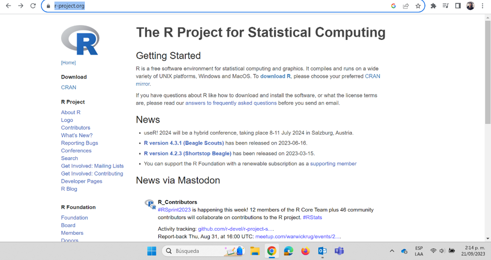
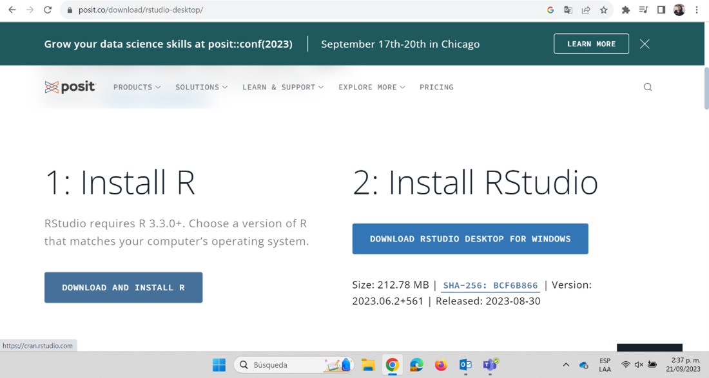
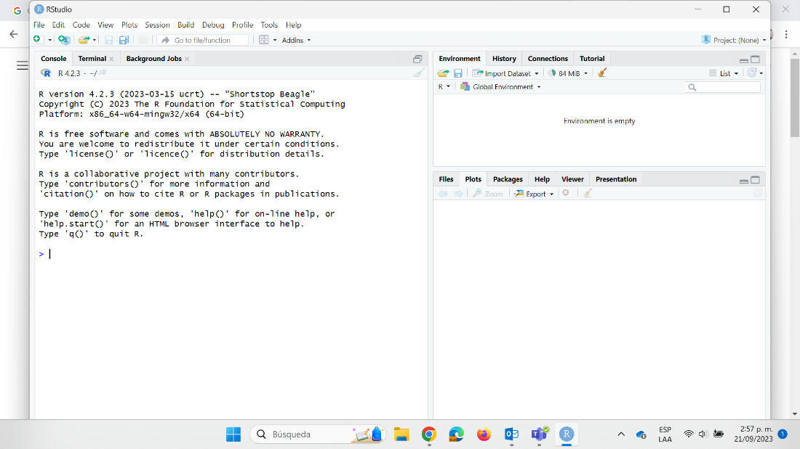
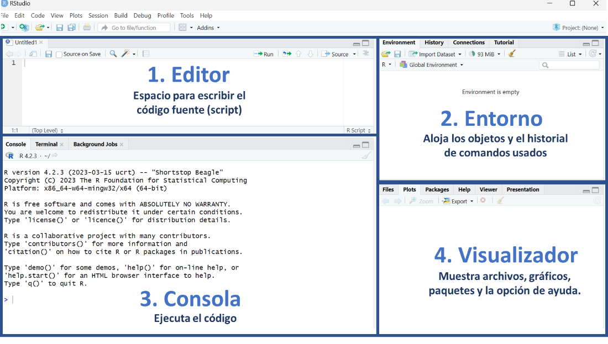
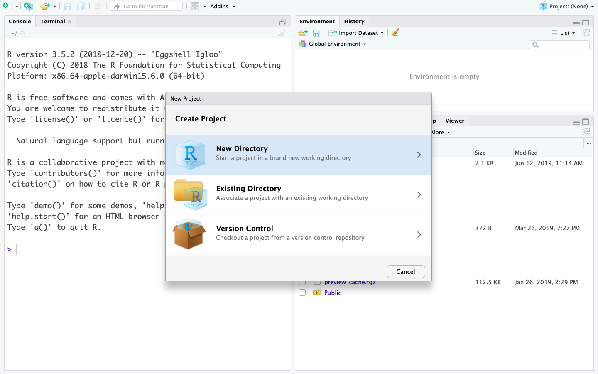
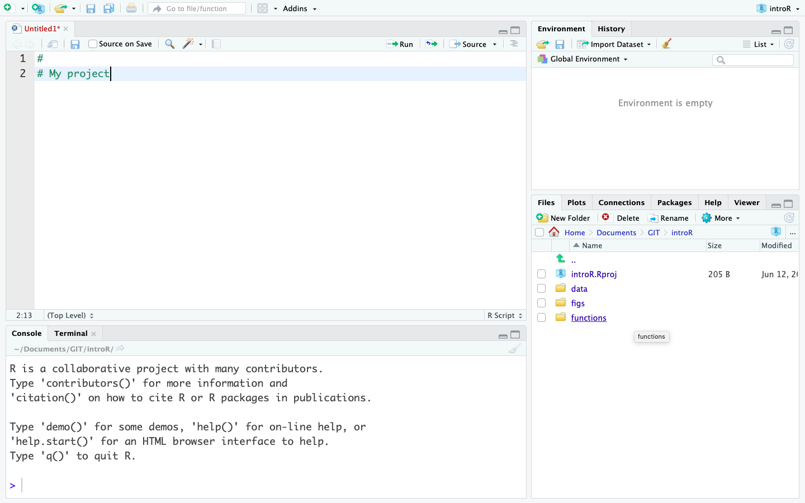
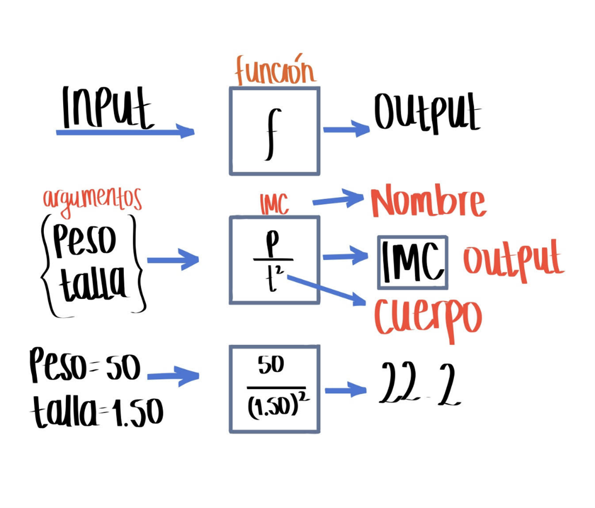

```{r setup, include=FALSE}
knitr::opts_chunk$set(echo = TRUE)
```

## 1. Introducción

R es un lenguaje de programación y un entorno de software utilizado en la práctica estadística y el análisis de datos. R y RStudio son herramientas esenciales para el estudio, análisis y toma de decisiones en salud pública, ya que permiten realizar análisis estadísticos detallados, modelar la propagación de enfermedades, visualizar datos de manera efectiva y automatizar tareas. Estas herramientas facilitan la manipulación y preparación de datos, fomentan la colaboración en proyectos de ciencia de datos, y la toma de decisiones basadas en evidencias. Además, son útiles en la formación y educación en análisis de datos para profesionales de la salud, áreas STEM y toma de decisiones. En este taller aprenderemos a reconocer los distintos elementos de la interfaz de RStudio, estructuras en R y manejo de datos con Tidyverse. Esto sentará las bases fundamentales para adquirir las habilidades necesarias en la programación en R y el análisis de datos.

### 2. Objetivos

- Reconocer y hacer uso de R y RStudio.
- Conocer los tipos de datos y operados básicos en R.
- Comprender las estructuras básicas de datos en R tales como vectores y tablas de datos.
- Comprender el proceso de creación de funciones.
- Reconocer el proceso de importación, exportación y transformación de bases de datos con Tidyverse.

### Tabla de contenido
- Tema 1: Introducción
- Tema 2: Instalación de R y RStudio
- Tema 3: Ambiente de RStudio
- Tema 4: Configuración de un proyecto en RStudio
- Tema 5: Tipos de datos y operadores en R
- Tema 6: Estructuras de datos en R
- Tema 7: Funciones

### Tema 1: Introducción a R

R es un lenguaje de programación especializado para análisis de datos, es de uso gratuito y software libre. Por otra parte, RStudio es un editor de R también disponible de manera gratuita. La diferencia entre R y RStudio radica en que en R es el lenguaje de programación en el que escribimos el código y RStudio es el ambiente de desarrollo que permite trabajar con R de manera más fácil y amigable.

En los últimos años el uso de R ha crecido en el ámbito académico y de la industria. R, además de ser un lenguaje de programación, es también un entorno para computación estadística y creación de visualizaciones. R y RStudio son herramientas esenciales para el estudio, análisis y toma de decisiones en salud pública, ya que permiten realizar análisis estadísticos detallados, modelar la propagación de enfermedades, visualizar datos de manera efectiva y automatizar tareas. Estas herramientas facilitan la manipulación y preparación de datos, fomentan la colaboración en proyectos de ciencia de datos, y la toma de decisiones basadas en evidencia. Además, son útiles en la formación y educación en análisis de datos para profesionales de la salud, áreas STEM y toma de decisiones.


## Tema 2: Instalación de R y RStudio

Para instalar R y RStudio debemos ir a nuestro navegador de confianza. Allí vamos a buscar r-project, que es la página oficial de R (https://www.r-project.org/). Recordemos que este es un software de uso libre, no hay que hacer ningún pago por su descarga o uso.

<center>

</center>

Busca la opción de descarga “download R” y sigue las instrucciones.

Para instalar Rstudio debemos ir a https://posit.co/download/rstudio-desktop/ y buscar donde diga Install RSudio. Si tenemos Windows podemos dar click en el recuadro azul. Si es otro sistema operativo abajo encontraremos una lista con las diferentes opciones. Para instalar, sigue las instrucciones.

<center>

</center>

Recuerda ejecutar el archivo que se descargó siguiendo los pasos. Es recomendable que en el momento de la instalación elijamos la opción de dejar un acceso directo en el escritorio.

Para comprobar que la instalación fue satisfactoria y en general para hacer uso de R y RStudio debemos buscar en la ubicación que hayamos elegido en la instalación donde quedó Rstudio y dar doble clic o clic derecho y abrir. Lo primero que vemos al momento de abrir Rstudio es la siguiente pantalla:

<center>

</center>

Escribe 2+2 donde aparece el curso y da enter, si te aparece el resultado 4 ¡Está todo listo para empezar!


## Tema 3: Ambiente de RStudio

La parte visual de RStudio está compuesta por 4 secciones principales:

<center>

</center>

1. **Editor (sección superior izquierda):** esta sección es fundamental para la reproducibilidad del código. Este editor permite guardar el código para que sea usado en futuras ocasiones. 
El código puede ser ejecutado en esta sección posicionando el cursor de texto al final de la línea de código que se ejecutará; otra opción es seleccionando la misma y empleando el comando `Control+Enter` para Windows o `Command+Enter` para Mac.

2. **Entorno (sección superior derecha):** en esta sección se pueden visualizar los objetos y funciones creados o importados en la sección de R. 
Objetos como vectores, matrices, arreglos, `data frames`, listas, objetos tipo `ggplot`, entre otros.

3. **Consola (sección inferior izquierda):** esta sección es donde se ejecuta el código. No solo se ejecuta el código que escrito en el editor, sino que también el código puede escribirse y ejecutarse aquí directamente presionando `Enter`. Sin embargo, cuando el código se ejecuta directamente en la consola, este no se almacena y cuando se cierra la sesión de R este se pierde.

4. **Visualizador (sección inferior derecha):** en esta sección se pueden visualizar los archivos en “`Files`”, los gráficos en “`Plots`”, los paquetes que ya están instalados en “`Packages`”, la ayuda de R con información de los paquetes y el funcionamiento en “`Help`”, y páginas web en “`Viewer`”.


## Tema 4: Configuración de un proyecto en RStudio

Una de las grandes ventajas de usar RStudio es la posibilidad de usar
los Proyectos en R (R Project)(indicado por un archivo `.Rproj`) lo que permite organizar el espacio de trabajo, el historial y los documentos fuente.

Para crear un Proyecto en R, es importante seguir los siguientes pasos:

(1) Abrir RStudio y, en la esquina superior derecha, seleccionar la pestaña
    **File (Archivo) -\> New Project... (Proyecto Nuevo)**.
(2) Se desplegará una ventana con encabezado **New Project Wizard: Create Project**, ahora se debe seleccionar **New Directory (Directorio Nuevo)**.

<center>

</center>

(3) En la ventana **Project Type**, se debe seleccionar **New Project -\> Create New Project**. En la casilla **Directory Name (Nombre del Directorio)** coloque el nombre deseado para su proyecto (Ej: "`introR`").

(4) Hacemos clic en el botón **Browse...** para buscar la ubicación dentro de nuestro computador donde deseamos guardar el proyecto.

(5) Creamos una carpeta con el mismo nombre del proyecto (Ej: "`introR`"), así como las subcarpetas que necesitamos para organizar nuestro trabajo y resultados: datos, scripts y figuras. Al final, el proyecto debería parecerse a esta imagen:

<center>

</center>


## Tema 5. Tipos de datos y operadores en R

### 5.1. Tipos de datos
R tiene la capacidad de almacenar y procesar distintos tipos de datos.
Entre estos se encuentran:


- Numéricos fraccionados `(double. Ej: 3.3)`
- Enteros `(integer. Ej: 3)`
- Caracteres `(character. Ej: municipio, sexo o nombre)`
- Booleanos o lógicos `(logic. Ej: FALSE, TRUE)`
- Tipo fechas `(date. Ej: 01/01/2022)`
- Datos `NA`, `NAN` e `Inf`. La diferencia entre `NA`, `NAN` e `Inf` es que `NA` indica que hay dato faltante “missing”, `NAN` significa “not a number”; es decir, hay información, pero es un error y el resultado no es numérico, por ejemplo `0/0`. `Inf` indica que hay operaciones cuyo resultado es infinito como por ejemplo `1/0`. Si se hace operaciones entre tipos variables se pueden obtener `Inf`.


### 5.2. Operadores

Los operadores herramientas matemáticas que nos permiten realizar diferentes tareas con los datos que tenemos disponibles; por ejemplo, con el operador `+` podemos efectuar una suma o incrementar un índice. Algunos de los operadores más utilizados en R son los siguientes:

#### 5.2.1.  Operadores aritméticos `(Ej: +, -, *` que corresponden a suma, resta y multiplicación respectivamente)

#### 5.2.2.  Operadores de comparación `(Ej: <, >, ==, >=, <=, !=)`

#### 5.2.3.  Operadores booleanos `(& (and), | (or), ! (not))`

#### 5.2.4. Operadores de asignación 

`<-` Este es un operador común en R para asignar un determinado valor a una variable y el alcance está dentro de la función y también fuera de ella.

Ejemplo
```{r, error = TRUE, eval = FALSE}
nombre <- "Laura"
```

`=` Este operador se utiliza para establecer un parámetro en un valor dentro de una función. El alcance está solo dentro de la función. La variable todavía contiene su valor original fuera de la función


## Tema 6. Estructuras en R

### 6.1. Vector 

En R, un vector es una estructura de datos indexada que permite almacenar varios elementos del mismo tipo en una única estructura. Por ejemplo, podríamos tener un vector que contenga las edades de varias personas, o un vector que contenga los nombres de diferentes ciudades.

Los vectores en R son útiles porque permiten realizar operaciones y cálculos con facilidad. Los elementos del vector se pueden sumar, restar, multiplicar o dividir, y sus elementos son accesibles por medio posición o índice.

En resumen, un vector en R es una colección ordenada de elementos del mismo tipo de datos (ver Tema 5) que permite almacenar y manipular datos de manera eficiente.

Para crear un vector en el código o script se escribe el nombre con el que se va a reconocer (por ejemplo, edad o ciudad) y luego se debe escribir el símbolo `<-` (que da la orden a R para crear el vector). Luego se escribe letra `c` que es la asignación que permite inicializar el vector. Cada componente debe ir separado por comas, si son caracteres debe ir entre comillas (si son números no), si es dato booleano (falso o verdadero) tampoco va en comillas.

Así, los vectores se pueden crear ejecutando el comando `c()`, como se puede visualizar a continuación:


```{r, error = TRUE, eval = TRUE}

nombre <- c("Emilia", "Maximo", "Axel", "Diana") # Nombre de las personas

ciudad <- c("La Plata","Concepcion", "Cuzco", "Bogota") # Ciudad de residencia

edad <- c(18, 20, 37, 42)  # Edad de las personas

vacunado <- c(TRUE, FALSE, FALSE, TRUE) # Estado de vacunación

dosis <- c(2L, 0L, 1L, 2L) # Número de dosis recibidas`
```

Nota: El uso del símbolo `#` permite comentar el código, es decir poner notas que expliquen una o más líneas del código.


### 6.2. Data.frame (Tabla de datos)

Imaginemos un `data.frame` como una tabla con filas y columnas, similar a una hoja de cálculo en Excel. Cada columna representa un tipo de información específica (un vector) o variable (Por ejemplo, la edad, el departamento o el nombre). En este ejemplo, cada fila corresponde al registro de esas variables para un individuo. Es importante tener en cuenta que los `data.frame` (Tabla de datos) están compuestos por vectores cuyas dimensiones deben ser iguales, es decir que todas las columnas deben tener el mismo número de filas. Siguiendo la analogía de Excel, podemos pensar que cada vector es una columna de una hoja de Excel.

Una ventaja de trabajar con `Data.frame` en R en vez de una hoja de excel es que a medida que el tamaño de la tabla va aumentando, en R se puede trabajar más rápido y eficientemente.

Para crear una tabla de datos se debe ejecutar el comando `data.frame()`. Por ejemplo, utilizando los vectores que definimos en la sección anterior:

```{r, error = TRUE, eval = TRUE}
datos_vacunas <- data.frame(
  nombre = nombre, 
  ciudad = ciudad,
  edad = edad,
  vacunado = vacunado,
  dosis = dosis)
```

Ahora observemos cómo quedó la tabla de datos

```{r, error = TRUE, eval = TRUE}
datos_vacunas 
```

Algunas funciones que permiten conocer características como nombres o tamaños de las filas o columnas del `data.frame` son:

- `colnames()`: nombres de las columnas
- `rownames()`: nombres de las filas
- `nrow()`: número de filas
- `ncol()`: número de columnas 
- `length()`: longitud de la tabla de datos

Ahora, para acceder a la descripción de la estructura general de una tabla de datos (y en general cualquier objeto de R) usamos el comando `str`, en este caso escribimos:

```{r, error = TRUE, eval = TRUE}
str(datos_vacunas)
```

Esto nos indica que la estructura `(datos_vacunas)` corresponde a un `data.frame` con 4 observaciones y 5 variables.

Si usamos el comando `str(datos_vacunas$nombre)` podemos ver la estructura de esa variable, que en este caro es un vector de caracteres con longitud de 1 a 4.

```{r, error = TRUE, eval = TRUE}
str(datos_vacunas$nombre)
```

Para acceder a los diferentes componentes de la tabla de datos usamos la sintaxis `[,]`, donde la primera dimensión corresponde a filas y la segunda dimensión a columnas.

Por ejemplo, si queremos saber cuántas dosis de vacunas se aplicó Maximo ¿qué debemos hacer? Veamos a qué fila y columna corresponde este dato: 

```{r, error = TRUE, eval = FALSE}
datos_vacunas
```

Vemos que Maximo está en la fila 2 y las dosis en la columna 5. Por lo tanto, la intersección de estas dos variables nos dará el número de dosis que tiene Maximo.

```{r, error = TRUE, eval = TRUE}
datos_vacunas[2, 5] 
```


### 6.3. Crear y abrir tablas de datos

R nos permite no solo crear tablas de datos sino también abrir archivos que las contengan. De hecho, la mayoría de las veces no se crean directamente los `data.frame` en R sino que se importa un `data.frame` de alguna fuente de datos, por ejemplo, la base de datos del sistema de vigilancia de algún evento de interés. Para esto, en R hay tres fuentes de conjuntos de datos que podemos utilizar:

-   Tabla de datos importada (desde los formatos `.xlsx`, `.csv`,`.stata`, o `.RDS`, entre otros)
-   Tabla de datos que forma parte de un paquete en R (Ej. `MASS, islands`, etc)
-   Tabla de datos creado durante la sesión en R (Ej. las estructuras de los primeros ejercicios)

#### 6.3.1. Importar una tabla de datos

Para importar una tabla de datos de diferentes fuentes necesitamos emplear diferentes tipos de funciones, aquí algunos ejemplos del tipo de datos, y la librería que es necesario cargar y la función a utilizar.

| Tipo de datos | Función                        | Paquete |
|---------------|--------------------------------|---------|
| csv           | read_csv                       | readr   |
| xls           | read_excel, read_xls,read_xlsx | readxl  |
| RDS           | readRDS                        | base    |
| dta           | read_dta                       | haven   |
| sas           | read_sas                       | haven   |


#### 6.3.2. Abrir y explorar una tabla de datos importados de Excel

Este es el conjunto de datos para esta práctica:
[datos_covid.xlsx](https://raw.githubusercontent.com/TRACE-LAC/TRACE-LAC-data/main/datos_covid.xlsx):

Dentro del directorio en el que está trabajando actualmente, cree una
carpeta llamada *data*. Guarde la tabla de datos descargado en la
carpeta *data* que acaba de crear.

Para importar tablas de datos desde RDS, se puede usar la función
`read_excel`, del paquete `readxl`:

```{r, eval=FALSE}
library(readxl)
covid19 <- readRDS("data/datos_covid.RDS")
```

## Tema 7: Funciones

Imaginemos una función como una especie de “caja mágica” que recibe ciertos datos o información como entrada y produce un resultado o respuesta específica como salida. Es como seguir una receta que toma ingredientes y como resultado tenemos un plato delicioso.

Para qué podamos utilizar una función debemos proporcionar unos datos de entrada *(input)* que entran a la caja (la función) y de ahí sale un resultado o datos de salida *(output)*. La función puede ser suma, resta, regresión logística o un modelo matemático. Entran datos y salen otros que son producto de las operaciones en la función.

Los componentes básicos de una función son:

- **name (nombre)**: es el nombre que se da a la función(Por ejemplo: myfun)
- **formals (argumentos):** son la serie de elementos que controlan cómo llamar a la función.
- **body (cuerpo):** es la serie de operaciones o modificaciones a los argumentos.
- **output (salida o resultado)**: son los resultados después de modificar los argumentos. Si esta salida corresponde a una serie de datos, podemos extraerla usando el comando `return`.


**Ejemplo:**  Con una base de datos queremos generar una variable que es producto de una operación, por ejemplo, IMC (índice masa corporal).

La función del IMC es conocida ($peso/(talla^2)$), y sus argumentos son *peso* y *talla*.

Recordemos que en esta fórmula el *peso* debe estar en *kg* y la *talla* en *metros*.

Para este ejemplo el *input*, o datos de entrada son el *peso* y la variable *talla*, y el *output* sería el índice de masa corporal (IMC). Si tenemos que el *peso* es *50kg* y la *talla 1.5m*, el IMC será igual a *22.2*.

<center>
{width=10.0cm}
</center>

(Ilustración adaptada por Maria Paula Forero)

En R podemos producir la función IMC mediante el siguiente código:

```{r, eval = TRUE}
IMC <- function(peso, talla) { # Aquí van los argumentos o input
    resultado <- peso/ talla^2  # Esta es el cuerpo u operación       
    return(resultado)           # Este es el output o resultado
 }
```

Ahora, utilicemos la función para calcular el IMC de una persona de talla 1.75 cm y peso 80 kg, mediante el siguiente código

```{r, eval = TRUE}
IMC(peso = 80, talla = 1.75)
```

Como se puede ver, para usar la función una vez establecida solo se requiere el nombre y los argumentos.

**Reto:** Usando la misma función calcula tu IMC.

En general, una función consiste en una secuencia de instrucciones con el fin de llevar a cabo una tarea. De esta forma, por medio del uso de funciones es posible sistematizar procesos complejos que se realizan de manera rutinaria.


### Enlaces utiles

[Introducción a
R](http://people.umass.edu/biep640w/pdf/RStudio101%20-%20Introduction%20by%20Oscar%20Torres-Reyna.pdf)

[Historia de
R](https://www.genbeta.com/desarrollo/introduccion-a-r-historia-de-un-lenguaje-de-computacion-para-el-analisis-de-datos)

## Contribuciones

-   Zulma M. Cucunuba: Versión inicial
-   Zhian N. Kamvar: Ediciones menores
-   Kelly A. Charniga: Ediciones menores
-   José M. Velasco-España: Traducción de Inglés a Español y edición
-   Andree Valle-Campos: Ediciones menores
-   Miguel E. Gámez López: Ediciones menores
-   Nicolás T. Domínguez: Ediciones menores
-   Jaime A. Pavlich-Mariscal: Edición

Contribuciones son bienvenidas vía [pull
requests](https://github.com/reconhub/learn/pulls).

## Asuntos legales

**Licencia**: [CC-BY](https://creativecommons.org/licenses/by/3.0/)
**Copyright**: Zulma M. Cucunuba, 2019
