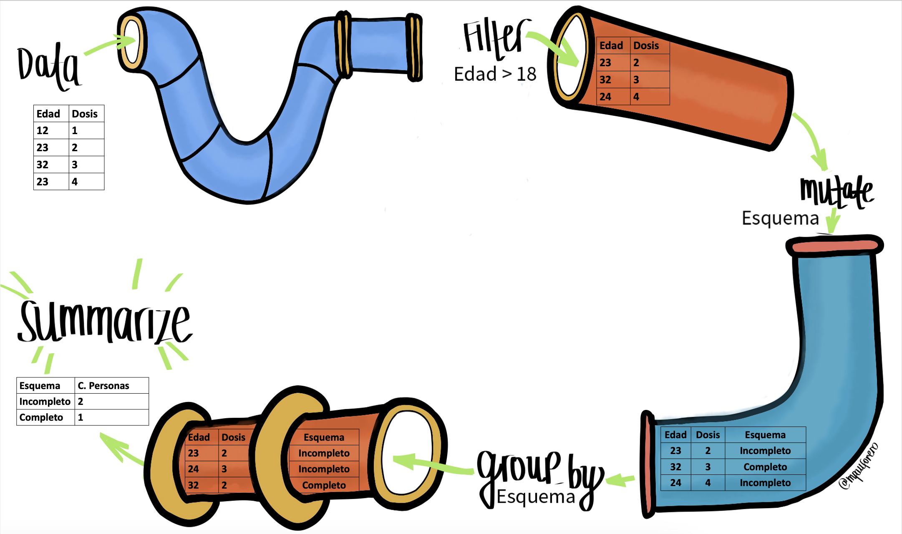

```{r setup, include=FALSE}
knitr::opts_chunk$set(echo = TRUE)
```

## 1. Introducción

R es un lenguaje de programación y un entorno de software utilizado en la práctica estadística y el análisis de datos. R y RStudio son herramientas esenciales para el estudio, análisis y toma de decisiones en salud pública, ya que permiten realizar análisis estadísticos detallados, modelar la propagación de enfermedades, visualizar datos de manera efectiva y automatizar tareas. Estas herramientas facilitan la manipulación y preparación de datos, fomentan la colaboración en proyectos de ciencia de datos, y la toma de decisiones basadas en evidencias. Además, son útiles en la formación y educación en análisis de datos para profesionales de la salud, áreas STEM y toma de decisiones. En este taller aprenderemos a reconocer los distintos elementos de la interfaz de RStudio, estructuras en R y manejo de datos con Tidyverse. Esto sentará las bases fundamentales para adquirir las habilidades necesarias en la programación en R y el análisis de datos.

## 2. Objetivos

- Reconocer y hacer uso de R y RStudio.
- Conocer los tipos de datos y operados básicos en R.
- Comprender las estructuras básicas de datos en R tales como vectores y tablas de datos.
- Comprender el proceso de creación de funciones.
- Reconocer el proceso de importación, exportación y transformación de bases de datos con Tidyverse.

### 3. Tabla de contenido
- Tema 8: Manipulación de datos con Tidyverse
- Tema 9: Reto


## 4. Temas

### Tema 8. Manipulación de datos con Tidyverse

Para administrar mejor los conjuntos de datos, se recomienda instalar y utilizar el paquete `tidyverse`, el cual carga automáticamente varios paquetes (dplyr, tidyr, tibble, readr, purr, entre otros) que son útiles para la manipulación de datos.

```{r,eval=FALSE,echo=TRUE}
install.packages('tidyverse')
```

```{r message=FALSE, warning=FALSE, include=TRUE}
library(tidyverse)
```

A continuación, verá algunas de las funciones más utilizadas de
`tidyverse`.

### 8.1. Operador tubería (pipe)

El operador tubería (pipe function) `%>%` es un operador que se usa continuamente, por lo que es clave para usar Tidyverse y facilita la
programación. El operador tubería permite al usuario enfatizar una
secuencia de acciones en un objeto.



#### Ejemplos

**Ejemplo 1**

La siguiente línea de código
```{r, error=TRUE, eval = FALSE}
str(datos_vacunas)
```
es equivalente a:
```{r, error=TRUE, eval = FALSE}
datos_vacunas %>% str()
```
**Ejemplo 2**
Supongamos que necesitamos sumarle 1 a una lista de números, luego multiplicar todos sus elementos por 2 y a continuación calcular su promedio. Sin el uso de el operador tubería, estas operaciones se pueden realizar de la siguiente manera:
```{r, error=TRUE, eval = FALSE}
numeros <- c(5, 10, 15, 20)
suma_uno <- numeros + 1
multiplicado_por_dos <- suma_uno * 2
promedio <- mean(multiplicado_por_dos)
```
Utilizando el operador tubería, la sintaxis de esta operación se puede simplificar:
```{r, error=TRUE, eval = FALSE}
library(magrittr)
numeros <- c(5, 10, 15, 20)
promedio <- numeros %>%  + 1 %>% multiply_by(2) %>%  mean()
```

### 8.2. Funciones básicas de Tidyverse
Del paquete `dyplr`, las funciones más comunes son:

-   `glimpse`: utilizado para explorar rápidamente una tabla de datos
-   `summarise`: genera tablas resumen. Reduce las dimensiones de una
    tabla de datos
-   `group_by`: crea grupos dentro de una tabla de datos. las
    funciones del `dplyr` manipulan cada grupo por separado y luego
    combina los resultados
-   `select`: extrae columnas de una tabla de datos
-   `filter`: extrae filas de una tabla de casos
-   `arrange`: ordena filas de una tabla de datos por el valor de una
    variable particular si es numérico, o por orden alfabético si es un
    carácter
-   `mutate`: genera una nueva variable
-   `rename`: cambia el nombre de la variable

Otra función que se utiliza continuamente en el análisis de datos es:
-   `unique`: te permite extraer sólo los elementos únicos del conjunto de datos, eliminando las repeticiones

Veamos en más detalle las funciones más comunes del paquete `dyplr`

### 8.2.1. `glimpse`

Esta función se utiliza para explorar información de los datos como: número de filas (que en este caso sería el número de observaciones o datos de nuestra población), número de columnas y sus nombres (que en este caso serían el número de variables y sus nombres), entre "\< \>" encontrará el tipo de dato (`dbl` para `double`, `chr` para `character`, entre otros) y un breve listado de algunos de los primeros valores de los datos. La función `glimpse` se puede aplicar sobre `dat` mediante el operador tubería como se muestra a continuación:

```{r, error=TRUE, eval = FALSE}
covid19 %>% glimpse()
```

### 8.2.2.`summarise`

La función `summarise` permite resumir los datos de acuerdo con criterios definidos por funciones que retornan valores que pueden ser de interés. Por ejemplo, para calcular la media de edad y el conteo total de casos:

```{r, error=TRUE, eval = FALSE}
covid19 %>% summarise(media = mean(edad), numero = n())
```

### 8.2.3.`group_by`

La función `group_by` no tiene un uso evidente si es empleada sola, dado
que ocurre un proceso interno de agrupación de los datos. Pero al ser
usada con otras funciones como por ejemplo `summarise` es posible ver su
efecto. Por ejemplo, el siguiente comando agrupa los datos por sexo y calcula, para cada grupo, el conteo de casos y su correspondiente media de edad:

```{r, error=TRUE, eval = FALSE}
covid19 %>% 
  group_by(sexo) %>% 
  summarise(numero = n(), media_edad = mean(edad))
```

### 8.2.4.`select`

La función `select` es útil en caso de querer extraer una o varias columnas de un Data.frame. Por ejemplo, se puede extraer la variable `edad` de `dat` mediante el siguiente comando:

```{r, error=TRUE, eval = FALSE}
covid19 %>% select(edad) #empleando el nombre de la columna
covid19 %>% select(c(1,2)) #o su ubicación en los datos
```

### 8.2.5.`filter`

Otra función de gran utilidad es `filter`. Esta se puede usar para seleccionar filas de acuerdo con una o más condiciones lógicas. Por ejemplo, para filtrar los pacientes menores de 28 años:

```{r, error=TRUE, eval = FALSE}
covid19 %>% filter(edad < 28)
```

Como puede observar, el resultado contiene todas las variables de la tabla, pero los datos se limitan a aquellos que en edad sean menores de 28 años.

Ahora, filtre por los pacientes de 28 años o menos de sexo femenino. En este caso,
al pedir que se incluyan adicionalmente los de 28 años también ya no se
emplea unicamente el signo "\<" sino que se lo acompaña del símbolo "=":

```{r, error=TRUE, eval = FALSE}
covid19 %>% glimpse() #Observe como están expresadas las variables también puede usar la función `table()`
covid19 %>% filter(sexo == "F", edad <= 28) #Ahora sabe como filtrar el sexo
```

### 8.2.6.`arrange`

Para los casos donde se necesita organizar los datos por una o más
variables, se puede emplear la función `arrange`. Por ejemplo, para organizaros datos por edad, o por edad y sexo:

```{r, error=TRUE, eval = FALSE}
covid19 %>% arrange(edad)
covid19 %>% arrange(edad,sexo)
```

Por configuración predeterminada la función organiza los valores de
menor a mayor, en caso de querer organizarlos de mayor a menor se puede
emplear `desc` al interior de la función `arrange`.

```{r, error=TRUE, eval = FALSE}
covid19 %>% arrange(desc(edad))
```

### 8.2.7.`mutate`

Para crear una nueva columna con datos de una ya existente resulta de
utilidad la función `mutate`. Esta función requiere el nombre de la
columna a crear y de la columna de la que queremos copiar los datos. La
columna nueva por configuración predeterminada se ubicará al final de
las variables.

```{r, error=TRUE, eval = FALSE}
unique(covid19$nombre_departamento)
covid19 <- covid19 %>% mutate(nombre_departamento = toupper(nombre_departamento))
```

### 8.2.8.`rename`

En caso de que no se desee crear una nueva variable sino renombrar una ya existente, conviene usar la función `rename`. Por ejemplo, cambie el
nombre *nombre_departamento* por el nombre *departamento*.

```{r, error=TRUE, eval = FALSE}
covid19 %>% rename(departamento = nombre_departamento)
```

### 8.2.9.`slice`

Ya se vio previamente cómo seleccionar columnas por medio de la función `select`. En caso de requerir seleccionar filas específicas de un Data.frame, la función `slice` resulta de gran utilidad. Por ejemplo, para seleccionar de la fila 10 a la 15:

```{r, error=TRUE, eval = FALSE}
covid19 %>% slice(10:15)
```

Alternativamente, en caso de que no se quiera emplear tidyverse, esta acción podría realizarse mediante el siguiente comando:

```{r, error=TRUE, eval = FALSE}
covid19[10:15, ]
```

Sin embargo, usar tidyverse y sus funciones resulta de gran utilidad. Por ejemplo, suponga que necesita obtener los primeros 5 sujetos de la base que tengan edades entre 13 y 14 años por cada sexo. Usando tidyverse, la solución de este problema se vería así:

```{r, error=TRUE, eval = FALSE}
covid19 %>% 
  group_by(sexo) %>% 
  filter(edad >= 13, edad <=14) %>%
  slice(1:5)
```

En caso de uno usar el operador tubería (pipe), el comando anterior se vería así:

```{r, error=TRUE, eval = FALSE}
slice(filter(group_by(covid19, sexo),edad >= 13, edad <=14),1:5)
```

Como puede notar, el resultado es idéntico. Sin embargo, es preferible usar el operador tubería cuando se aplican varias funciones sucesivamente sobre un objeto porque simplifica la sintaxis del código y, como se puede ver, la lectura del mismo se hace más sencilla. Además, emplear el operador tubería facilita la modificación del proceso en caso de ser necesario.

## 9. Reto

Esta vez se cargará un tipo diferente de datos, estos los puede
encontrar en el enlace
<https://github.com/TRACE-LAC/TRACE-LAC-data/blob/main/datos_covid.RDS?raw=true>.
Los datos pueden ser cargados desde el computador o desde una ubicación
en internet. Para este ejercicio cargue la base de datos datos_covid.RDS
directamente desde internet con los comandos:

```{r, error=TRUE, eval = FALSE}
url <- "https://github.com/TRACE-LAC/TRACE-LAC-data/blob/main/datos_covid.RDS?raw=true"

covid19 <- readr::read_rds(url)
```

Por favor, realice las siguientes actividades:

-   **Explore los datos**

Como puede observar los nombres de las columnas (variables) están con
algunas letras en mayúsculas, otras con tildes y con espacios. Lo
primero que es necesario hacer es poner los nombres en una forma que
permitan evitar errores, es decir, todos en minúsculas, sin caracteres
especiales, tildes ni espacios. Para ello se usará la función
`clean_labels` del paquete `epitrix`.

```{r, error=TRUE, eval = FALSE}
#Primero se llamarán los nombres de las variables con la función `names`
names(covid19)
#ahora a estos nombres se les reasignará nombres limpios
names(covid19) <- names(covid19) %>% epitrix::clean_labels()

names(covid19)
```

Ahora que los nombres están limpios es posible seguir.

-   Filtre los datos para Cali (observe bien cómo están escritos los
    datos dentro de la variables)
-   Agrupe los datos por departamento y cuente los casos por cada uno.
-   Agrupe los datos por departamento y saque la media de edad de cada
    uno.
-   Cambie el nombre de estado por gravedad.
-   Ordene los datos por sexo y seleccione las 5 primeras filas de cada
    uno.
-   Haga una tabla que muestre cuantas personas de cada etnia aparecen en la base 
    ubicados en la ciudad de Bogota.
-   Seleccione las 5 primeras filas de solo el número de identificación
    del caso.

### Enlaces utiles

[Introducción a
R](http://people.umass.edu/biep640w/pdf/RStudio101%20-%20Introduction%20by%20Oscar%20Torres-Reyna.pdf)

[Historia de
R](https://www.genbeta.com/desarrollo/introduccion-a-r-historia-de-un-lenguaje-de-computacion-para-el-analisis-de-datos)

## Contribuciones

-   Zulma M. Cucunuba: Versión inicial
-   Zhian N. Kamvar: Ediciones menores
-   Kelly A. Charniga: Ediciones menores
-   José M. Velasco-España: Traducción de Inglés a Español y edición
-   Andree Valle-Campos: Ediciones menores
-   Miguel E. Gámez López: Ediciones menores
-   Nicolás T. Domínguez: Ediciones menores
-   Jaime A. Pavlich-Mariscal: Edición

Contribuciones son bienvenidas vía [pull
requests](https://github.com/reconhub/learn/pulls).

## Asuntos legales

**Licencia**: [CC-BY](https://creativecommons.org/licenses/by/3.0/)
**Copyright**: Zulma M. Cucunuba, 2019
