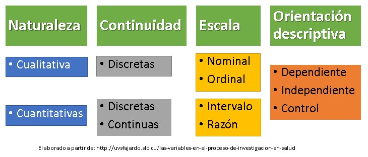

```{r setup, include=FALSE}
knitr::opts_chunk$set(echo = TRUE)
```

```{r include=FALSE}
library(readr)
library(tidyverse)
library(nortest)
library(epitrix)

```

## 1. Introducción

En este taller usted aprenderá un abordaje para la limpieza y
organización de datos epidemiológicos mediante el uso de RStudio. Este
taller se realizará a tráves del uso de una guía de aprendizaje.

## 2. Objetivos

-   Reconocer herramientas que facilitan la limpieza de datos

-   Listar buenas prácticas de la limpieza de datos

-   Reconocer el proceso de limpieza y organización de bases de datos

<!-- Se podría poner una pregunta de reflexión antes de iniciar la explicación de los conceptos por ejemplo, Por qué consideran que es importante realizar limpieza de los datos, o qué problemas se les ha presentando o creen se pueden presentar si no se efectúa este proceso? -->

## 3. Conceptos básicos a desarrollar

En esta práctica se desarrollarán los siguientes conceptos:

-   Caracterización de una base de datos

-   Clasificación de variables

-   Normalidad <!-- Como nota poner el concepto -->

-   Medidas de tendencia central <!-- Como nota poner el concepto -->

-   Medidas de dispersión <!-- Como nota poner el concepto -->

-   Tablas de contingencia

## 4. ¿En qué consiste el proceso de limpieza de datos?

---> Por favor lea y reflexione sobre este tema (10 minutos)

La limpieza de datos es un proceso dinámico que debe ajustarse a las
exigencias de la tabla de datos, si bien al ser un proceso que no tiene
siempre un mismo camino no se puede establecer un flujo de actividades
único, es posible agrupar estas actividades en tres grupos de procesos
esenciales.

a)  Exploración y caracterización

b)  Limpieza y corrección

c)  Organización

Dentro de **exploración y caracterización** se pueden encontrar algunas actividades como:

-   Revisión de la documentación
    
-   Revisión de la estructura de los datos

-   Revisión del formato de los datos

-   Revisión de la coherencia del contenido de las variables. Esta
    actividad se puede realizar mediante la creación de gráficas; por
    ejemplo, con fechas se pueden crear curvas históricas

-   Revisión del contenido de las variables para la verificación de
    valores sin sentido. Esto incluye casos tales como: fechas o variables
    numéricas que erroneamente contienen caracteres, así como variables con información 
    inconsistente (ej. niño, niao, nino, ni\$no)

<!-- Indicar la salida esperada de estas actividades -->

Dentro de **limpieza y corrección** se pueden encontrar
actividades como:

-   Eliminación de variables que no tengan utilidad en responder la
    pregunta de investigación

-   Corrección de formato de las variables (ej. de numérica a caracter o viceversa)

-   Corrección de datos que no correspondan a la definición de la variable

-   Corrección de datos con nombres o caracteres erróneos

-   Eliminación de datos que no se puedan corregir

Finalmente, dentro de **organización** se pueden encontrar
actividades como:

-   Organización de las variables (ej. dar nombres significativos)

-   Almacenamiento de la base de datos limpia

### Paquetes útiles para la limpieza de datos

La limpieza de datos depende de ciertas preferencias y del análisis o procesamiento que se vaya a efectuar sobre las mismas.

Sin embargo, aquí se presentan algunas librerías que pueden ser de
gran utilidad para este taller.

- **_tidyverse_**: es una librería que viene ligada a otras como _readr_, _tidyr_,
_dplyr_, _ggplot2_, entre otras esenciales para el manejo, limpieza y
organización de datos

- **_epitrix_**: es una librería que contiene funciones como `clean_labels`, la cual
permite limpiar nombres para que cumplan con estándares de buenas practicas.


## 5. Documentación básica de los datos

Antes de empezar a trabajar con datos es necesario conocer los datos para no
caer en errores analíticos que puedan llevar a perder la validez
científica de la investigación por el uso de herramientas incorrectas.
Para la caracterización se puede empezar por conocer información de la tabla
de datos como el formato en el que está, licencia de distribución (sus
derechos de uso), el peso de la tabla de datos, número de variables
recolectadas, número de datos, descripción de las variables, definición
y tipo de las mismas, fecha de actualización, frecuencia de
actualización, que variables contiene y cómo fueron recolectadas,
metodología de su recolección, entre otros elementos necesarios para
comprender cómo se obtuvo y cómo puede ser usada. Por ejemplo,
información sobre la base de datos de COVID a nivel nacional puede
encontrarse en: 
<https://www.datos.gov.co/Salud-y-Protecci-n-Social/Casos-positivos-de-COVID-19-en-Colombia/gt2j-8ykr>
o <http://url.ins.gov.co/dataset-covid-info>.

Por favor, diligencie la siguiente tabla con la información contenida en
el enlace.

| Categoría                                      | Información |
|------------------------------------------------|-------------|
| Formato                                        |             |
| Licencia de distribución                       |             |
| Peso                                           |             |
| Número de variables (escriba algunos ejemplos) |             |
| Número de datos recolectados                   |             |
| Hay descripción de las variables               |             |
| Tipo de las variables que contiene             |             |
| Fecha de creación                              |             |
| Última fecha de actualización                  |             |
| Frecuencia de actualización                    |             |
| ¿A qué se refiere N/A en cada variable?        |             |

: Tabla 1. Información de caracterización de una tabla de datos

Antes de proseguir con la caracterización de los datos conviene recordar
un poco sobre la clasificación de la variables.



:   Gráfica 1: Clasificación de variables

Para efectos de este ejercicio solo contemplaremos las 3 primeras
clasificaciones: naturaleza, continuidad y escala. Clasificar las
variables antes de procesarlas resulta necesario para operarlas
correctamente. Por ejemplo, la variable
"nombre del grupo étnico" contiene números en sus valores, sin
embargo, se establece qué un número representa una etnia (1-Indígena
2-ROM 3-Raizal 4-Palenquero 5-Negro 6-Otro), por tanto, analizarlo como
una variable numérica resultaría en un error. En este caso es una
variable cualitativa, discreta, nominal. Por favor, complete la
siguiente tabla clasificando cada variable.

| **Nombre de la variable**    | Clasificación de la variable. Según naturaleza, continuidad y escala. | Tipo de dato Almacenamiento | Valores que puede tomar la variable |
|------------------------------|-----------------------------------------------------------------------|-----------------------------|-------------------------------------|
| Fecha de reporte en web      |                                                                       |                             |                                     |
| ID de caso                   |                                                                       |                             |                                     |
| Fecha de notificación        |                                                                       |                             |                                     |
| Código DIVIPOLA departamento |                                                                       |                             |                                     |
| Nombre departamento          |                                                                       |                             |                                     |
| Código DIVIPOLA municipio    |                                                                       |                             |                                     |
| Nombre municipio             |                                                                       |                             |                                     |
| Edad                         |                                                                       |                             |                                     |
| Unidad de medida de edad     |                                                                       |                             |                                     |
| Sexo                         |                                                                       |                             |                                     |
| Tipo de contagio             |                                                                       |                             |                                     |
| Ubicación del caso           |                                                                       |                             |                                     |
| Estado                       |                                                                       |                             |                                     |
| Código ISO del país          |                                                                       |                             |                                     |
| Nombre del país              |                                                                       |                             |                                     |
| Recuperado                   |                                                                       |                             |                                     |
| Fecha de inicio de síntomas  |                                                                       |                             |                                     |
| Fecha de muerte              |                                                                       |                             |                                     |
| Fecha de diagnóstico         |                                                                       |                             |                                     |
| Fecha de recuperación        |                                                                       |                             |                                     |
| Tipo de recuperación         |                                                                       |                             |                                     |
| Pertenencia étnica           |                                                                       |                             |                                     |
| Nombre del grupo étnico      |                                                                       |                             |                                     |

Ahora que se ha completado el abordaje inicial es necesario cargar la
tabla de datos para una exploración más profunda. En el taller de **Introducción a R y R Studio** se
aprendió a cargar una tabla de datos desde Internet. Por favor, cargue esta tabla
de datos
<https://github.com/TRACE-LAC/TRACE-LAC-data/blob/main/datos_covid.RDS>.

Es hora de explorar la tabla de datos. Para este ejercicio se ha obtenido
una muestra aleatoria de la tabla de datos, por favor con lo aprendido en el taller anterior revise la cantidad de datos que contiene la
muestra, limpie los nombres de las variables y verifique que tipo de
datos están almacenados en cada variable. La parte de cargar la tabla de datos y limpiar los nombres de las variables lo puede hacer ejecutando el código que se muestra a continuación:

```{r error=TRUE, include= TRUE}

url_data <- "https://github.com/TRACE-LAC/TRACE-LAC-data/blob/main/datos_covid.RDS?raw=true"

covid <- readr::read_rds(url_data)

names(covid) <- names(covid) %>% epitrix::clean_labels()
```


Para explorar los datos se puede realizar una aproximación general o
específica a cada variable. Por ejemplo, usando la función summary.

```{r}
summary(covid)
```

Esta función permitirá dar un vistazo general a la información,
brindando más detalle para las variables numéricas y fechas, como es el
caso de fecha_reporte_Web o edad. Mientras que no brinda mucha
información en variables de tipo carácter, lógicas o donde el número
tiene un significado de identificación como es el caso de id_de_caso o
sexo. Para obtener información de estas variables es necesario
convertirlas en variables tipo factor. En el taller anterior se mencionó
sobre estas variables y se mencionó que son útiles para categorías.
Pueden haber variables tanto ordinales (con orden) como nominales.
Además, convertir  una variable en factor resulta especialmente útil
para gráficos y regresiones. Convierta las variables
nombre_departamento, nombre_municipio, tipo_de_contagio,
tipo_de_recuperacion, ubicacion_del_caso, estado, recuperado,
pertenencia_etnica, nombre_del_grupo_etnico en tipo factor y luego
ejecute nuevamente summary.

En caso de que la información suministrada no sea la esperada es
necesario hacer una evaluación individual de los datos.

Para variables cuantitativas se puede realizar una exploración de
información descriptiva como:

| Información                                                                                                 | Función                    | Resultado                    |
|-------------------------------------------------------------------------------------------------------------|----------------------------|------------------------------|
| Obtener valor mínimo                                                                                        | `min(covid$edad)`          | `r min(covid$edad)`          |
| Obtener valor máximo                                                                                        | `max(covid$edad)`          | `r max(covid$edad)`          |
| Obtener el valor máximo y mínimo                                                                            | `range(covid$edad)`        | `r range(covid$edad)`        |
| Obtener el promedio                                                                                         | `mean(covid$edad)`         | `r mean(covid$edad)`         |
| Obtener la varianza                                                                                         | `var(covid$edad)`          | `r var(covid$edad)`          |
| Obtener la desviación estándar                                                                              | `sd(covid$edad)`           | `r sd(covid$edad)`           |
| Obtener un valor en un cuantil. En este caso el valor medio o mediana                                       | `quantile(covid$edad, .5)` | `r quantile(covid$edad, .5)` |
| Obtener el rango intercuartílico                                                                            | `IQR(covid$edad)`          | `r IQR(covid$edad)`          |
| Obtener al tiempo valor mínimo, primer cuartil, mediana, media, tercer cuartil, valor máximo y número de NA | `summary(covid$edad)`      | `r summary(covid$edad)`      |

: Tabla 3. Exploración de variables cuantitativas

Al realizar la exploración anterior no se tuvo en cuenta la
documentación y por tanto, la exploración podría tener errores. ¿Sabe
qué error se cometió? ¿Cómo lo solucionaría?

<!-- No se tuvo en cuenta la unidad de medida de edad, no todos los datos están en años -->

Para variables cualitativas, que no se quiera transformar a tipo factor,
se puede usar la función `table`, al no ser una función del paquete
`tidyverse` para poder acceder a una variable interna es necesario
emplear el símbolo `$` después del nombre de la base y el nombre de la
variable después del símbolo `$`.

```{r}
table(covid$sexo)
```

Se obtuvo información de los datos al interior de la variable explorada,
tanto los nombres como las veces que esos nombres se repiten. Esta
función se puede usar para cualquier tipo de variable. Sin embargo, es
preferible su uso en variables cualitativas, cuando se emplea para
variables con un gran número de datos usar `table` puede resultar en una
gran demanda de recursos del sistema y en la obtención de datos sin
valor analítico.

La función `table` tiene una variación que permite observar los datos en
proporciones:

```{r}
prop.table(table(covid$sexo))
```

Aunque también se pueden redondear y observar como porcentajes

```{r}
proporciones <- prop.table(table(covid$sexo))
proporciones
redondeado <- round(proporciones, 3)
redondeado
redondeado*100
```

Otra forma de adquirir información de las variables cualitativas es a
través de la función `unique` de la librería `tidyverse`. La cual
permitirá acceder a los valores de la variable sin que se repitan. Es
similar al resultado obtenido de la función `table` pero brinda
exclusivamente el contenido.

```{r}
unique(covid$sexo)
```

## 6. Exploración gráfica

Además de los métodos anteriores para explorar datos, es posible
realizarlo mediante gráficos. Para este objetivo se pueden emplear
histogramas, cajas de bigotes, entre otros.

Como se mencionó antes los histogramas resultan de utilidad para
explorar fechas. Dado que los datos son de Covid, resulta coherente tener
fechas de reporte que estén ubicadas entre 2020 y 2022. Un error usual
es encontrar fechas por fuera de ese rango. Como en el siguiente caso:

```{r}
hist(covid$fecha_reporte_web,breaks = "weeks")
```

Como se puede ver en el gráfico hay algunos datos inconsistentes que causan que la gráfica se afecte.

```{r}
covid %>% arrange(fecha_reporte_web) %>% head
```

En este caso es un valor pero podrían existir varios cientos de estos. Para corregir este tipo de errores se puede eliminar las filas que contienen estos datos o reasignar a estos valores con datos tipo _NA_ para no perder la demás información.

```{r}
#Primero es necesario buscar los valores para luego reemplazarlos
## Busque los valores
covid %>% filter(fecha_reporte_web < as.Date("2020-03-01"))
#Reemplácelos

covid$fecha_reporte_web <- replace(covid$fecha_reporte_web, covid$fecha_reporte_web < as.Date("2020-03-01"), NA)

```

Ahora vuelva a producir la gráfica y observela.
```{r}
#Observe cómo cambio la gráfica
hist(covid$fecha_reporte_web,breaks = "weeks")
```

Otra forma de visualizar las variables con fechas es modificando cómo se la mide. Por ejemplo, puede pasar la fecha a días.

```{r}
covid$fecha_reporte_web_dias <- as.numeric((as.Date(covid$fecha_reporte_web) - min(as.Date(covid$fecha_reporte_web), na.rm = TRUE))) 

hist(covid$fecha_reporte_web_dias)
```
Sin embargo, es necesario considerar su utilidad. Por ejemplo, podría observar el retraso entre el tiempo de inicio de síntomas y el de reporte.

```{r}
covid$retraso <- as.numeric((as.Date(covid$fecha_de_notificacion) - as.Date(covid$fecha_de_inicio_de_sintomas)))

hist(covid$retraso)
```
¿Qué observa en la gráfica? ¿Cómo lo interpretaría?

Acerque un poco la gráfica

```{r}
hist(covid$retraso[covid$retraso < 25])

hist(covid$retraso[covid$retraso > 25 & covid$retraso < 50])

hist(covid$retraso[covid$retraso > 50])

```

Tras acercar la gráfica. ¿Cambiaron sus conclusiones?

Los histogramas también son útiles para explorar otros tipos de datos numéricos.

```{r}
hist(covid$edad)
```

Mientras que otros tipos de gráficos como cajas de bigotes no resultan
útiles para la exploración de fechas.

```{r}
boxplot(covid$fecha_reporte_web)
```

Pero pueden resultar de gran utilidad para explorar otras variables
numéricas. Dado que brinda visualización de datos como mediana, rango
intercuartílico y permite visualizar datos atípicos.

```{r}
covid %>% filter(unidad_de_medida_de_edad == 1) %>% select(edad) %>% boxplot()
```

Para explorar frecuencias en variables categóricas resultan de utilidad
los gráficos de barras.

```{r}
barplot(table(covid$sexo))
barplot(table((covid$nombre_departamento)),las=2, cex.names = 0.5)
```

## 7. Correcciones dentro de la tabla de datos

Cómo pudo verse en el último ejemplo la variable *sexo* presenta 3
valores, "F", "M" y "m". Dado que la base en su documentación refiere
que los valores recolectados fueron: "F-Femenino M-Masculino". Para
corregir ese error y otros que puedan aparecer se puede hacer uso de la
función `replace`. Ejecute el código a continuación:

```{r}
## Corrija el problema

covid$sexo <- replace(covid$sexo, covid$sexo == "m", "M")
#Para empezar escriba la variable que modificará y aignele la función replace
#Replace tiene tres argumento. El primero vector o variable donde se hará el cambio. 
#Segundo las posiciones donde está el termino a reemplazar puede hacer con el comparador "==". 
#Finalmente ponga el termino que reemplazará esas posiciones.

#Revise si se solucionó
unique(covid$sexo)

```

Este problema también se esta presentando en la variable
*nombre_departamento* y *estado*. Por favor, corrijalo.

Esta función puede emplearse también en corrección de fechas.

## 8. Eliminación de variables innecesarias

Cuando se realizó la exploración con summary entre los datos se encontró
que las variables nombre_del_pais y codigo_iso_del_pais son del tipo
lógico. Explorelas para observar su contenido

```{r}
unique(covid$codigo_iso_del_pais)
str(covid$codigo_iso_del_pais)
glimpse(covid$codigo_iso_del_pais)
```

Como se puede observar son variables que no tienen nada en su interior.
Además, al ser datos únicamente de Colombia no nos resultarían útiles
aún si tuvieran contenido. Una vez identificadas las variables que no
tienen relevancia en el análisis a realizar se procede a eliminarlas.
Esta eliminación no afecta la base de datos almacenada en el computador o la nube, unicamente a la de la sesión de
R. Para eliminar estas variables ejecute el código a continuación:

```{r}
#La base covid tiene 23 variables
ncol(covid)
#Para eliminarlas se le pedirá a R a través de las función select, que seleccione todas las columnas excepto las que van dentro del vector, para este objetivo se añadirá el símbolo "-" delante del vector. 
covid <- covid %>% select (-c("codigo_iso_del_pais", "nombre_del_pais"))
#Es necesario comprobar el cambio.
ncol(covid)
```

Por favor, explore las variables codigo_divipola_departamento y
codigo_divipola_municipio. En caso que considere que no son necesarias
para este proceso eliminelas.


## 9. Corrección de formato en las variables

Como se mencionó antes algunas variables podrían tener un formato
errado. Cuando examinó la variable fecha de muerte ¿en qué formato
estaba? ¿qué formato debería tener? ¿Afectará la exploración y
procesamiento de los datos?

```{r eval=FALSE, warning=TRUE, include=TRUE}
hist(covid$fecha_de_muerte,breaks = "weeks")
#Error in hist.default(covid$fecha_de_muerte, breaks = "weeks") : 'x' must be numeric
```

¿En qué afecto?

En esos casos el error puede corregirse al modificar el formato de la
variable. Para esto es necesario llamar la variable con el error y
asignarle la misma variable pero con el formato correcto.

```{r}
covid$fecha_de_muerte <- as.Date(covid$fecha_de_muerte)
hist(covid$fecha_de_muerte,breaks = "weeks")
```

## 10. Manejo de NAN, NA e Inf.

Al examinar la variable anterior se puede notar que existen varios datos
"NA". Por favor, medite cúal sería la razón detrás de esto. ¿Es un error?

Para verificar la existencia de datos tipo NA y su ubicación puede usar
la función \`is.na\`. Para evitar una lista muy larga y sin sentido se
pueden almacenar en un objeto o usar la función table para obtener un
resumen.

```{r}
table(is.na(covid$fecha_nacimiento))

```

En algunos casos este tipo de datos pueden afectar la obtención del
resultado

```{r}
mean(c(3,2,NA))

```

Para omitir este tipo de datos en algunas funciones se puede agregar
\`na.rm\` de forma que se omitan y no afecten el resultado.

```{r}
mean(c(3,2,NA), na.rm = TRUE)
```

Sin embargo, no es el único tipo de datos que puede alterar el
resultado. También se puede encontrar NAN e Inf. En el ejemplo de abajo
se omite los valores NA pero aún así sigue arrojando un resultado no
deseado.

```{r}
mean(covid$fecha_nacimiento)
```

```{r}
mean(covid$fecha_nacimiento, na.rm = TRUE)
```

Para identificar estos valores y su posición se puede emplear la función
\`is.infinite\`

```{r}
table(is.infinite(covid$fecha_nacimiento))
```

Antes de eliminar estos valores o impostarlos es importante saber su
origen para evitar perder información valiosa. Normalmente son el origen
de operaciones como dividir entre 0.

Otro tipo de valores que pueden representarse como error son los valores
NAN, estos se refieren a que no son numéricos. Puede suceder cuando en
un vector numérico se ingresan caracteres no numéricos como el número en
palabras o el número acompañado de símbolos.

Para identificar estos valores se emplea la función is.nan

```{r}
table(is.nan(covid$fecha_nacimiento))
```

## 11. Identificación y eliminación de datos incosistentes

Como se menciono anteriormente es importante identificar los datos con errores para corregirlos o en última instancia corregirlos. Un error frecuente en datos con fechas es cuando una fecha que debe ir antes como por ejemplo la fecha de infección esta antes de otra fecha como la de recuperación que debería ir después. Para realizar esta revisión lo primero será asegurarse que las fechas estén en el formato correcto.

```{r}
covid$fecha_de_inicio_de_sintomas <- as.Date(covid$fecha_de_inicio_de_sintomas, format = "%Y-%m-%d")

#verifique el cambio
str(covid$fecha_de_inicio_de_sintomas)

covid$fecha_de_recuperacion <- as.Date(covid$fecha_de_recuperacion, format = "%Y-%m-%d")

#verifique el cambio
str(covid$fecha_de_recuperacion)
```

Ahora es necesario verificar si existe errores en estas. Para ello ejecute el siguiente código:
```{r}
errores <- which((covid$fecha_de_recuperacion < covid$fecha_de_inicio_de_sintomas))
```
Ahora tiene un vector con las posiciones de los errores ¿Cómo eliminaría estas filas con errores?

¿Qué otras variables corregiría? ¿Qué otros errores cree que podrían existir?

## 12. Identificación y eliminación de duplicados

Cuando se trabaja con datos pueden presentarse casos donde se registra
más de una vez al mismo sujeto, los mismos datos para dos sujetos o dos
sujetos bajo un mismo código. Cada uno de estos casos requiere una
revisión minuciosa para tomar la decisión si eliminar el dato o
impostarlo.

En el caso cuando hay filas con infomación de sujetos duplicadas se
puede hacer uso de la función `distinc` de dplyr, la cual permite saber
cuantas de las filas son distintas.

```{r}
nrow(covid)
nrow(distinct(covid))
```

Ahora para mantener solo las filas distintas se debe almacenar estas en
el objeto que contiene la base.

```{r}
covid <- distinct(covid)
nrow(covid)
```

Sin embargo, esta función no afectará aquellas que no sean idénticas. Piense ¿Qué pasaría si hay reinfecciones? ¿Cómo las identificaría? 


¿Qué observa en está tabla?

```{r}
conteo_reinfecciones <- covid %>% group_by(id_de_caso) %>% summarise(N = n())

table(conteo_reinfecciones$N)

```


## 13. Organización de la tabla de datos

Parte de la organización es dar nombres apropiados a las variables de
forma que permitan un adecuado análisis y evitar confusión. Como se vio
anteriormente, esto se puede lograr mediante la función `rename` de
dplyr.

```{r}
covid <- covid %>% rename(fecha_recuperacion = fecha_de_recuperacion)
```

¿A qué otras columnas les cambiaría el nombre?

## 14. Guardar conjuntos de datos procesados

Cuando se haya terminado de procesar los datos es importante guardar la
base de datos en el disco del computador, dado que todos los cambios
realizados hasta el momento se han realizado únicamente en la sesión de
R y una vez cerrada se perderían. Para esto se puede emplear la función
saveRDS. <!-- Aclarar que se pueden almacenar en la nube, VM, servidor o base de datos que se este trabajando pero para este caso se hara en el disco del computador-->

```{r eval=FALSE}
dir.create("datos/limpios") # cree un directorio de datos limpio si no existe

saveRDS(covid, "datos/limpios/datos_limpios_covid.RDS")#guarde los datos
```

En su carpeta de datos verá que ahora existe un archivo llamado
datos_limpios_covid.RDS. El archivo puede almacenarlo en formato xls o
xlsx para excel o en multiples formatos. Sin embargo, se recomienda RDS
por su bajo peso y capacidad de almacenamiento.

## 15. Otras formas de explorar los datos

Una vez la base está limpia es importante explorar la tabla de datos en cuanto a normalidad de los datos, cómo se comportan frente a otras, entre otros.

La normalidad puede ser evaluada gráficamente o con una prueba estadística como Shapiro-Wilk.
```{r}
hist(covid$edad)
```
¿Considera que la edad tiene una distribución normal? Haga una prueba.

```{r}
#Para esta prueba necesitamos el paquete nortest
#install.packages("nortest")
library(nortest)
ad.test(covid$edad)
```
El test de normalidad de Anderson-Darling toma como hipótesis nula que los valores son normales. Si el valor de p es significativo la hipótesis nula será rechazada.

¿Qué observa en la gráfica? ¿Qué podría evaluar?

```{r include=FALSE}
covid$estado <- replace(covid$estado, covid$estado == "leve", "Leve")
covid$sexo <- replace(covid$sexo, covid$sexo == "m", "M")
covid$sexo <- replace(covid$sexo, covid$sexo == "N/A", NA)
covid$estado <- replace(covid$estado, covid$estado == "N/A", NA)
```

```{r}
boxplot(covid$edad ~ covid$sexo + covid$estado)
```


<!-- ## 15. Calculo de tasa de letalidad (CFR) -->

<!-- Abajo puede observar los tipos de desenlaces. -->

<!-- ```{r} -->
<!-- table(covid$estado) -->
<!-- ``` -->
<!-- Para calcular la tasa de letalidad es fundamental conocer el número de fallecidos y el número total de casos diagnosticados como infectados con desenlace conocido.[1] -->
<!-- ^[1] En este caso se calcula el CFR y no el IFR porque para este sería necesario conocer la totalidad de la población que fue infectada. -->
<!-- ```{r} -->
<!-- n_fallecimientos <- sum(covid$estado %in% "Fallecido") -->

<!-- # Es necesario verificar cuantos NA tiene la variable estado. -->

<!-- table(is.na(covid$estado)) -->

<!-- #Dado que en este caso la exploración de los datos arrojo que la columna estado no tenía espacios reconocidos como NA, sino unos espacios diligenciados con los caracteres "N/A". Se obtendrá la totalidad de casos conocidos restando a la totalidad los casos con estos carateres. -->

<!-- n_dx_desenlace_conocido <- nrow(covid) - sum(covid$estado == "N/A") -->

<!-- #Ahora se puede calcular el CFR -->

<!-- cfr <- n_fallecimientos / n_dx_desenlace_conocido -->

<!-- # En caso de desear obtener el intervalo de confianza (IC) se puede obtener empleando la función binom. En caso que no la tenga instalada ejecute el comando install.packages("binom") y carguela para poder hacer uso de ella. -->
<!-- library(binom) -->
<!-- cfr_con_IC <- binom.confint(n_fallecimientos, n_dx_desenlace_conocido, method = "exact") -->

<!-- table(cfr_con_IC) -->
<!-- ``` -->


<!-- ## 16. Diseño de curvas epidemiológicas -->

<!-- ### Calcule la incidencia -->

<!-- Para calcular la incidencia se puede hacer uso del paquete `incidence`. En caso de que no lo tenga instalado por favor instalelo y carguelo. Este paquete permite obtener la incidencia diaria, semanal, mensual, trimestral o anual. Para más información emplee el siguiente código. -->

<!-- ```{r eval=FALSE} -->
<!-- vignette("incidence_class", package = "incidence") -->
<!-- ``` -->

<!-- Para calcular la incidencia a partir de la base de datos almacene el resultado en un objeto -->

<!-- ```{r} -->
<!-- #incidencia_diaria <- incidence(nombre_de_la_variable) -->
<!-- ``` -->
<!-- ```{r include=FALSE} -->
<!-- incidencia_diaria <- incidence(covid$fecha_de_inicio_de_sintomas) -->
<!-- ``` -->
<!-- Por ejemplo, para la incidencia de la fecha de inicio de síntomas, obtendrá una tabla así: -->
<!-- ```{r} -->
<!-- incidencia_diaria -->
<!-- ``` -->
<!-- Para generar la incidencia por un periodo diferente puede usar el argumento `interval` y añadir el número de días por el cual quiere calcular la incidencia o escribir las palabras en ingles (weeks, months, quarter, year) que pueden ir solas o acompañas de números. Por ejemplo: -->
<!-- ```{r} -->
<!-- incidencia_bimestral <- incidence(covid$fecha_de_inicio_de_sintomas, interval = "2 months") -->
<!-- incidencia_bimestral -->
<!-- ``` -->
<!-- ```{r} -->
<!-- incidencia_semanal <- incidence(covid$fecha_de_inicio_de_sintomas, interval = "7") -->
<!-- incidencia_semanal -->
<!-- ``` -->
<!-- Además es posible modificar el rango de fechas que se incluyen empleando el argumento `last_date`, ya sea para acortar el periodo o forzar su extensión.  -->

<!-- ### Grafique la incidencia -->

<!-- Para graficar la incidencia puede depender de la función `plot`. -->

<!-- ```{r} -->
<!-- plot(incidencia_diaria) -->
<!-- plot(incidencia_semanal, border = "red") -->
<!-- plot(incidencia_bimestral, border = "green") -->
<!-- ``` -->

<!-- Otra forma de visualización de la incidencia es a través de la escala logarítmica -->

<!-- ```{r} -->
<!-- ggplot(as.data.frame(incidencia_semanal)) +  -->
<!--   geom_point(aes(x = dates, y = log(counts))) +  -->
<!--   scale_x_incidence(incidencia_semanal) + -->
<!--   xlab("Fechas") + -->
<!--   ylab("Incidencia semanal log") +  -->
<!--   theme_minimal() -->
<!-- ``` -->

<!-- Así como previamente guardo la base de datos limpia puede de la misma forma almacenar los objetos creados. Por ejemplo, para almacenar la incidencia diaria puede realizar el mismo proceso: -->

<!-- ```{r eval=FALSE} -->
<!-- saveRDS(incidencia_diaria, "datos/limpios/incidencia_diaria.RDS") -->
<!-- ``` -->

<!-- El proceso de carga de estos se realiza de la misma forma que se realizo anteriormente.  -->

<!-- ```{r eval=FALSE} -->
<!-- incidencia_diaria <- readRDS("datos/limpios/incidencia_diaria.RDS") -->
<!-- ``` -->


## Sobre este documento

### Contribuciones

- José M. Velasco-España: versión inicial
- Guido Camargo-España & Zulma M. Cucunubá: ediciones a la versión inicial
- Miguel E. Gámez López:  Ediciones menores


### Asuntos legales

**Licencia**: [CC-BY](https://creativecommons.org/licenses/by/3.0/)
**Copyright**: José M. Velasco-España, Guido Camargo-España & Zulma M. Cucunubá, 2022

