```{r, include = FALSE, message = FALSE, warning = FALSE, error = FALSE}
library(knitr)
opts_chunk$set(collapse = TRUE)

CACHE <- TRUE
```

# 1. Introducción

En este taller aprenderemos sobre el uso del formato **R Markdown**, el cual permite integrar código en la generación de **informes** sin la necesidad de importar gráficas o crear tablas manualmente. De esta manera, el formato RMarkdown facilita la generación automática, actualización y redacción de informes técnicos al combinar la sintaxis del formato Markdown con código en R incrustado en el documento. 

# 2. Objetivos

-   Reconocer la importancia de generar informes en RMarkdown
-   Aprender a utilizar Rmarkdown de forma básica

# 3. Tabla de contenido
- Tema 1: ¿Qué es R Markdown?
- Tema 2: Estructura de R Markdown
- Tema 3: Paso a Paso en R Markdown
- Tema 4: ¿Cómo editar el texto en R Markdown?
- Tema 5: ¿Cómo editar el chunk de código?
- Tema 6: Hacer tablas en R Markdown
- Tema 7: Poner parámetros automatizados en el texto
- Tema 8: Paso final - “Tejer” (generar) el informe


# 4. Temas

## Tema 1: ¿Qué es R Markdown?

*R Markdown* es una extensión del formato Markdown que permite combinar texto con código R incrustado en el documento. De esta manera, los análisis y visualizaciones generados por medio del código se pueden incorporar de manera natural en el texto.

*R Markdown*  es ampliamente utilizado por científicos de datos, analistas, investigadores y profesionales que necesitan presentar sus análisis y resultados de manera clara y reproducible. Además, es una herramienta muy valiosa para generar informes automatizados y documentos técnicos interactivos


## Tema 2: Estructura de R Markdown

Un documento de **R Markdown** consta de tres tipos principales de elementos:

-   **Yaml:** corresponde a especificaciones del estilo del documento, título, fecha, autores, etc.

-   **Texto**: texto enriquecido con formato y explicaciones.

-   **Chunk**: bloque de código R en donde se ejecutan y se muestran sus resultados.

<center>
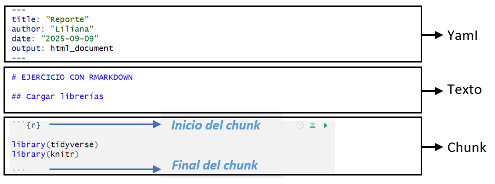{width="600"}
</center>


## Tema 3: Paso a Paso en R Markdown

### **Paso 1. Abrir R Studio desde R project**

De acuerdo a lo aprendido en la unidad de *Introducción a R y Rstudio*, es recomendable tener un R project donde quedará alojado el informe de R Markdown. Abre un R Project y sigue con el Paso 2.

### **Paso 2. Crear un nuevo archivo R Markdown**

Siguiendo la ruta **File>New File>R Markdown** podemos crear un archivo de R Markdown definiendo: título, autor(es) y formato de salida (html, pdf o word). Sigue los pasos que se muestran en la imagen, y crea tu archivo R Markdown con tu nombre y el título del reporte.

<center>

</center>


## Tema 4: ¿Cómo editar el texto en R Markdown?

- Para incluir el título de una sección se escribe el símbolo numeral #, dejar un espacio y poner el nombre de la sección en una línea única.

- Para poner subtítulos se utilizan dos símbolos numeral ##.

- Para cada subtítulo en la estructura se agrega otro símbolo numeral ## 1.

- Para escribir una palabra en **negrilla** use dos asteriscos a cada lado `**palabra**`

- Para escribir una palabra en *cursiva* use un asterisco a cada lado `*palabra*`

- Para situar el texto en un bloque aparte, se antecede este texto con el símbolo `>` en una línea única.

- Para dejar un especio (línea en blanco) antes de un párrafo anteceda **`<br>`**. Si desea doble espacio entonces use **`<br><br>`** y así sucesivamente.

Ejemplo: En el Tema 2 se colocó un título y un subtítulo en la seccion de Texto, que se visualizará en el documento final de la siguiente manera:

<center>
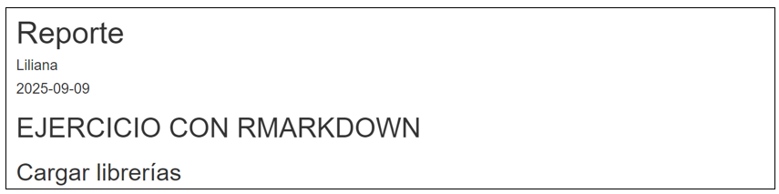{width="400"}
</center>


## Tema 5: ¿Cómo editar el chunk de código?

Para incluir código en R, es necesario introducir un **chunk** en el documento marcando en la barra de herramientas el icono *+C* de color verde como se muestra en la figura.

<center>
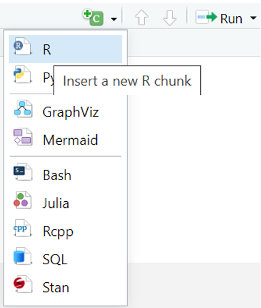{width="250"}

</center>


Al dar click en este ícono, aparecerá un espacio delimitado por los siguientes símbolos que corresponde al **`chunk:`**

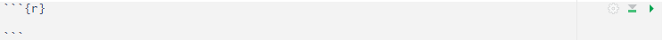

En el chunk, se le da la instrucción de cargar las librerías que se requieren para esta práctica: tidyverse y knitr.


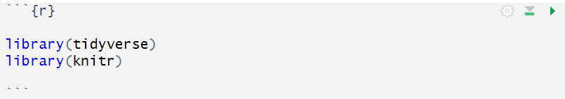

Podemos correr líneas de código específicas dentro del chunk; para esto, seleccione el código que desea correr y en el ícono "Run" seleccione la opción “Run Selected Line(s)”. Si desea correr todo el chunk, solo debe ubicarse en cualquier parte del chunk y seleccionar la opción "Run Current Chunk" dentro del ícono "Run".


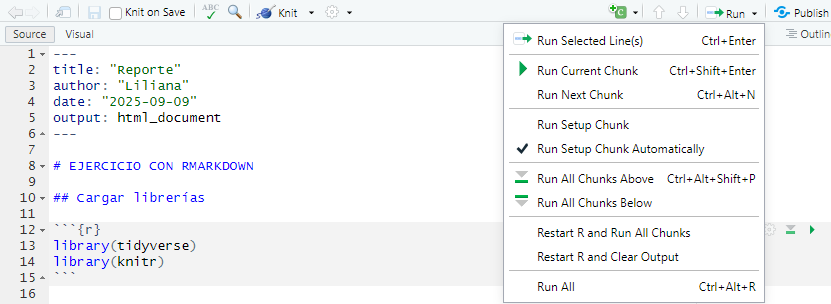

Otra opción es dar click al ícono de play verde que se encuentra en la parte superior derecha de cada Chunk.


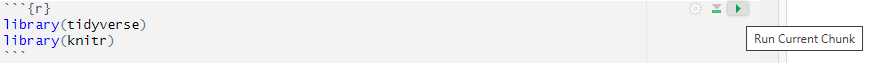


Al ejecutar el comando, se mostrará un mensaje informativo que indica que hay funciones con el mismo nombre en distintos paquetes, en este caso en dplyr y stats.

```{r}
library(tidyverse)
library(knitr)
```


### Especificar configuración del chunk

El chunk se puede configurar usando las funciones que aparecen en la tabla y que permiten decidir si se corre el chunk, si se muestra el código o los resultados en el documento, si deseas que no aparezcan los mensajes informativos o los mensajes de alerta, etc. La tabla muestra el tipo de salidas que quedan suprimidas al especificar las opciones eval, include, echo, message y warning como FALSE, y usando “hide” en las opciones results y fig.show.  

<center>
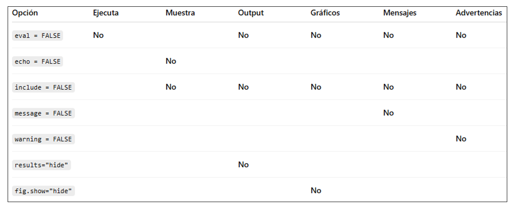
</center>  
<br>

A continuación, una descripción de cada una de las opciones del chunk:  

- **eval** decide si el chunk se ejecuta **(=TRUE)** o no **(= FALSE)**. Si se desea que el script aparezca en el documento, se debe especificar la opción **echo=TRUE**. 

- **echo** decide si se muestra **(=TRUE)** o no se muestra **(= FALSE)** el script en el documento. Con la opción **echo=FALSE** no se muestra el script pero si los resultados, gráficos, mensajes o advertencias. 

- **include** decide si lo que se ejecuta se incluye **(=TRUE)** o no **(=FALSE)** en el documento. Sirve para preparar datos, cargar paquetes o definir funciones que se usarán después.

- **message** decide si se muestran **(=TRUE)** o no se muestran **(= FALSE)** dentro del documento los mensajes de alerta. Por ejemplo, al cargar tidyverse se listan versiones y conflictos, así que si no deseamos que aparezcan en el documento, se debería especificar message=FALSE.

- **warning** decide si se muestran **(=TRUE)** o no **(= FALSE)** las advertencias (warnings) que produce el código; por ejempo, NaNs produced. Es decir, se ejecuta el chunk y se ven los resultados, pero no las advertencias.

- **results** controla cómo se muestra la salida de texto. La opción por defecto es **="markup"** (muestra la salida como texto normal), pero hay otras opciones: **="hide"** (ejecuta el chunk, pero oculta salidas de texto (ej. summary(), print()); no oculta gráficos, mensajes ni advertencias), **="hold"** (retiene todas las salidas del chunk y las muestra juntas al final en lugar de intercalarlas), **="asis"** (interpreta la salida como código Markdown o LaTeX crudo, y es útil para imprimir tablas limpias con knitr::kable() para que visualmente se ven mejor).

- **fig.show** controla cómo se muestran las figuras (gráficos) en el documento. La opción por defecto es **="asis"** (muestra las figuras a medida que se generan). Otras opciones son: **="hold"** (retiene todas las figuras del chunk y las muestra juntas al final del chunk), **="hide"** (ejecuta el chunk, pero no muestra las figuras en el documento).


**Los valores por defecto del chunk son:**

- eval = TRUE

- echo = TRUE

- include = TRUE
 
- message = TRUE

- warning = TRUE

- results = "markup"

- fig.show = "asis"

<br>

En nuestro ejemplo, si no queremos que aparezca en el documento el mensaje informativo al cargar las librerías, entonces adicionamos message=FALSE en el chunk:

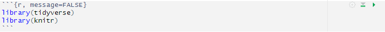

Así, se eliminará el mensaje y se visualizará en el documento así:

```{r, message=FALSE}
library(tidyverse)
library(knitr)
```

Si no queremos que el código aparezca dentro del documento, sino solamente que lo ejecute, entonces se adicionaría la opción echo=FALSE.

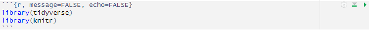

## Tema 6: Hacer tablas en R Markdown

Para hacer tablas en R Markdown podemos utilizar la función `kable` de la librería _knitr_. Para esta práctica es importante haber realizado la Unidad de Introducción a la visualización de datos en R con `ggplot2` y tener disponibles los materiales en el computador. La tabla de datos a utilizar se encuentra en: https://github.com/isp-javeriana/JornadasEpiBogota2025/blob/main/data/muestra_covid.RDS?raw=true

Con esta base de datos vamos a generar una tabla que muestre el número de casos por departamento. Usando la función kable, la tabla se visualizará en el documento final. Para esto, corremos el siguiente código: 

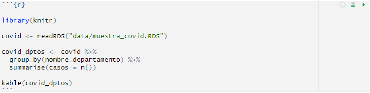

Como resultado, se visualizará el código y la tabla. Recuerde que para que no aparezca el código sino solo la tabla, debes especificar echo=FALSE. Puedes incluir igualmente (recomendable) message=FALSE y warning=FALSE para que no muestre ni mensajes ni advertencias. Con estas especificaciones el resultado sería: 

```{r, echo=FALSE}

library(knitr)

covid19 <- readRDS("data/muestra_covid.RDS")

covid_dptos <- covid19 %>% 
  group_by(nombre_departamento) %>% 
  summarise (casos = n())

kable(covid_dptos)
```


<br>
Incluya ahora el gráfico de barras correspondiente y adicione la opción echo=FALSE para que se muestre el gráfico pero no la programación.

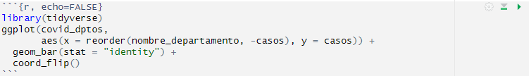

El gráfico se verá así:

```{r, echo=FALSE}
library(tidyverse)
ggplot(covid_dptos,
       aes(x = reorder(nombre_departamento, -casos), y = casos)) +
  geom_bar(stat = "identity") +
  coord_flip()
```

## Tema 7: Poner parámetros automatizados en el texto

En un reporte también es posible combinar código y texto, utilizando los resultados obtenidos en el código como parte del texto del reporte. Es decir, para evitar que debamos poner un resultado manualmente en el texto del reporte, podemos utilizar el resultado que obtuvimos al ejecutar el chunk  y hacer que este resultado aparezca en el texto de manera automática. Para esto, simplemente se debe parametrizar un valor y luego incluirlo en el texto usando su nombre correspondiente.

Por ejemplo, para calcular el total de casos de COVID-19 de sexo femenino en nuestro conjunto de datos dentro de un chunk de R haríamos lo siguiente:

```{r}
total_casos_fem <- nrow(covid19 %>% 
    filter (sexo == "F"))

```

Ahora, si queremos incluir este resultado en el texto del reporte, debemos especificar el parámetro que queremos usar de esta manera ` r total_casos_fem `, y por ejemplo escribir directamente como texto:

El total de casos de sexo femenino es ` r total_casos_fem`

```{r, echo=FALSE}
nrow(covid19 %>% 
     filter (sexo == "F"))

```


## Tema 8: Paso final - "Tejer" (generar) el informe

Para “tejer” el informe, es decir generar el informe en un formato específico (HTML, PDF o Word), debemos dar click en el símbolo “Knit” en la parte superior del editor del archivo de Rmarkdown. Tal como se ve en la siguiente imagen:

<center>
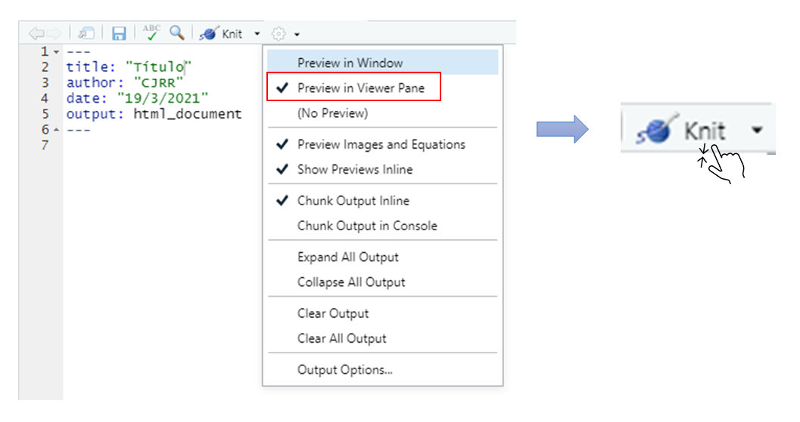{width="419"} 
</center>
<br>

Después de este paso debe aparecer el informe final en la presentación que hayamos seleccionado (html, pdf o word).

Observa cómo aparece la tabla y el texto del total de casos de sexo femenino.

*¡Felicitaciones, debes tener tu primer reporte R Markdown en html!*


# 5. Reto

Utilice parte del código desarrollado en la sección práctica de `ggplot` y con este, genere un informe en `pdf` o en `html`. 

## ¡Nos vemos en el próximo taller!

#Contribuidores

##Liliana Amaya


