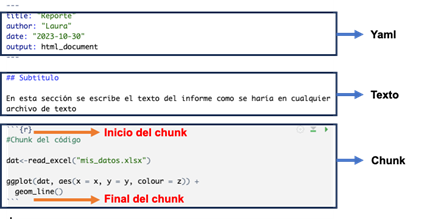

```{r options, include = FALSE, message = FALSE, warning = FALSE, error = FALSE}
library(knitr)
opts_chunk$set(collapse = TRUE)


CACHE <- TRUE

```

# 1. Introducción

En este taller aprenderemos sobre el uso del formato **R Markdown**, el cual permite integrar código en la generación de **informes** sin la necesidad de importar gráficas o crear tablas manualmente. De esta manera, el formato RMarkdown facilita la generación automática, actualización y redacción de informes técnicos al combinar la sintaxis del formato Markdown con código en R incrustado en el documento. 

# 2. Objetivos

-   Reconocer la importancia de generar informes en RMarkdown
-   Aprender a utilizar Rmarkdown de forma básica

# 3. Tabla de contenido
- Tema 1: ¿Qué es R Markdown?
- Tema 2: Estructura de R Markdown
- Tema 3: Paso a Paso en R Markdown
- Tema 4: ¿Cómo editar el texto?
- Tema 5: ¿Cómo editar el texto?¿Cómo editar el chunk de código?
- Tema 6: Hacer tablas en R Markdown
- Tema 7: Poner parámetros automatizados en el texto
- Tema 8: Paso final - “Tejer” (generar) el informe


# 4. Temas

## Tema 1: ¿Qué es R Markdown?

*R Markdown* es una extensión del formato Markdown que permite combinar texto con código R incrustado en el documento. De esta manera, los análisis y visualizaciones generados por medio del código se pueden incorporar de manera natural en el texto.

*R Markdown*  es ampliamente utilizado por científicos de datos, analistas, investigadores y profesionales que necesitan presentar sus análisis y resultados de manera clara y reproducible. Además, es una herramienta muy valiosa para generar informes automatizados y documentos técnicos interactivos


## Tema 2: Estructura de R Markdown

Un documento de **R Markdown** consta de tres tipos principales de elementos:

-   **Yaml:** Corresponde a especificaciones del estilo del documento, título, fecha, autores, etc.

-   **Texto**: Texto enriquecido con formato y explicaciones.

-   **Chunk**: Bloque de código R en donde se ejecutan y se muestran sus resultados.




## Tema 3: Paso a Paso en R Markdown

### **Paso 1. Abrir R Studio desde R project**

De acuerdo a lo aprendido en la unidad de *Introducción a R y Rstudio*, es recomendable tener un R project donde quedará alojado el informe de R Markdown. Abre un R Project y sigue con el Paso 2.

### **Paso 2. Crear un nuevo archivo R Markdown**

Siguiendo la ruta **File>New File>R Markdown** podemos crear un archivo de R Markdown definiendo: título, autor(es) y con formato de salida preferido (html, pdf o word).

Sigue los pasos, que también pueden verse en la imagen, y crea tu archivo R Markdown con tu nombre y el título de Reporte.

<center>

</center>

### **Paso 3. Editar el archivo de R Markdown y el código**

Es importante recordar que R Markdown tiene tres secciones, todas editables: Yaml, Texto y Chunk de código.

Al haber creado tu archivo de R Markdown podrás observar e identificar las diferentes secciones que se muestran en la imagen.


## Tema 4: ¿Cómo editar el texto?

- Para incluir el título de una sección se escribe el símbolo numeral # y a continuación el nombre de la sección en una línea única.

- Para poner subtítulos se utiliza dos símbolos numeral ##.

- Para cada subtítulo en la estructura se agrega otro símbolo numeral
 ## 1.

- Para escribir palabra en **negritas** use dos asteriscos a cada lado `**palabra**`

- Para escribir una palabra en *cursiva* use un asterisco a cada lado `*palabra*`(uno a cada lado)

- Para situar el texto en un bloque aparte, se antecede este texto con el símbolo `>` en una línea única.


## Tema 5: ¿Cómo editar el texto?¿Cómo editar el chunk de código?

Para incluir código en R, es necesario introducir un **chunk** en el documento marcando en la barra de herramientas el icono *+C* de color verde como se muestra en la figura.

{width="132"}

Al dar click en este ícono, aparecerá un espacio delimitado por los siguientes símbolos que corresponde al **`chunk:`**

```` ```{r} ````

```` ``` ````

Luego que hayas creado el chunk debemos cargar las librerías para esta práctica. En el chunk cargamos las librerías a utilizar en R. En este caso, necesitaremos dos

```{r}
library(tidyverse)
library(knitr)
```

Ahora debemos correr el Chunk dando click en el ícono de `“Run”` y seleccionando el Chunk que queremos correr.

{width="400"}

Otra opción es dar click al ícono de play verde que se encuentra en la parte superior derecha de cada Chunk.

{width="400"}


### Especificar configuración del chunk

Dentro del *chunk* también podemos especificar si queremos que el código aparezca en el impreso del informe o no usando `echo = FALSE` (para que no aparezca) y `echo = TRUE` (para mostrarlo).

La siguiente tabla incluye otras opciones que se pueden utilizar para configurar un *chunk*. En la tabla se muestra que tipo de salidas quedan suprimidas al especificar cada opción como `FALSE`:

```{r, echo = FALSE}

```

La siguiente tabla incluye otras opciones que se pueden utilizar para configurar un chunk. En la tabla se muestra que tipo de salidas quedan suprimidas al especificar cada opción como `FALSE`:\

| **Opción**          | **Ejecuta** | **Muestra** | **Output** | **Gráficos** | **Mensajes** | **Advertencias** |
|-----------|-----------|-----------|-----------|-----------|-----------|-----------|
| `eval = FALSE`      | No          |             | No         | No           | No           | No               |
| `include = FALSE`   |             | No          | No         | No           | No           | No               |
| `echo = FALSE`      |             | No          |            |              |              |                  |
| `results = "hide"`  |             |             | No         |              |              |                  |
| `fig.show = "hide"` |             |             |            | No           |              |                  |
| `message = FALSE`   |             |             |            |              | No           |                  |
| `warning = FALSE`   |             |             |            |              |              |                  |


Por ejemplo, en nuestra práctica especificaremos que se ejecute el código, como se muestra aquí.

```{r, eval = TRUE}

```


## Tema 6: Hacer tablas en R Markdown

Para hacer tablas en R Markdown podemos utilizar la función `kable` de la librería _knitr_, como se muestra a continuación.

Para esta práctica es importante haber realizado la Unidad de Introducción a la visualización de datos en R con `ggplot2` y tener disponibles los materiales disponibles en el computador.

La tabla de datos para esta práctica será la misma de la Unidad de Introducción a la visualización de datos en R con `ggplot2`. Puedes encontrarla en: https://github.com/TRACE-LAC/TRACE-LAC-data/blob/main/otros/muestra_covid.RDS?raw=true


```{r, results = "hide"}
library(knitr)

dat <- readRDS("data/muestra_covid.RDS")

covid_deptos <- dat %>% group_by(nombre_departamento) %>% summarise (casos = n())

kable(covid_deptos)
```

Como resultado, obtenemos la siguiente tabla:
```{r, echo = FALSE}
kable(covid_deptos)
```


## Tema 7: Poner parámetros automatizados en el texto

En un reporte también es posible combinar código y texto, utilizando los resultados obtenidos en el código como parte del texto del reporte. Es decir, para evitar que debamos poner un resultado manualmente en el texto del reporte, podemos utilizar el resultado que obtuvimos al ejecutar el chunk  y hacer que este resultado aparezca en el texto de manera automática. Para esto, simplemente se debe parametrizar un valor y luego incluirlo en el texto usando su nombre correspondiente.

Por ejemplo, para calcular el total de casos de COVID-19 de sexo femenino en nuestro conjunto de datos de datos datdentro de un chunk de R haríamos lo siguiente:

```{r}
total_casos_fem <- nrow(dat %>% filter (sexo == "F"))

```

Ahora, si queremos incluir este resultado en el texto del reporte, debemos especificar el parámetro que queremos usar de esta manera ` r total_casos_fem `, y por ejemplo escribir directamente como texto:

El total de casos de sexo femenino es ` r total_casos_fem`

```{r, echo=FALSE}
nrow(dat %>% filter (sexo == "F"))

```


## Tema 8: Paso final - "Tejer" (generar) el informe

Para “tejer” el informe, es decir generar el informe en un formato específico (HTML, PDF o Word), debemos dar click en el símbolo “Knit” en la parte superior del editor del archivo de Rmarkdown. Tal como se ve en la siguiente imagen:

<center>
{width="419"} 
</center>

Después de este paso debe aparecer el informe final en la presentación que hayamos seleccionado (html, pdf o word).

Observa cómo aparece la tabla y el texto del total de casos de sexo femenino.

*¡Felicitaciones, debes tener tu primer reporte R Markdown en html!*


# 5. Reto

Utilice parte del código desarrollado en la sección práctica de `ggplot` y con este, genere un informe en `pdf` o en `html`. 

## ¡Nos vemos en el próximo taller!
